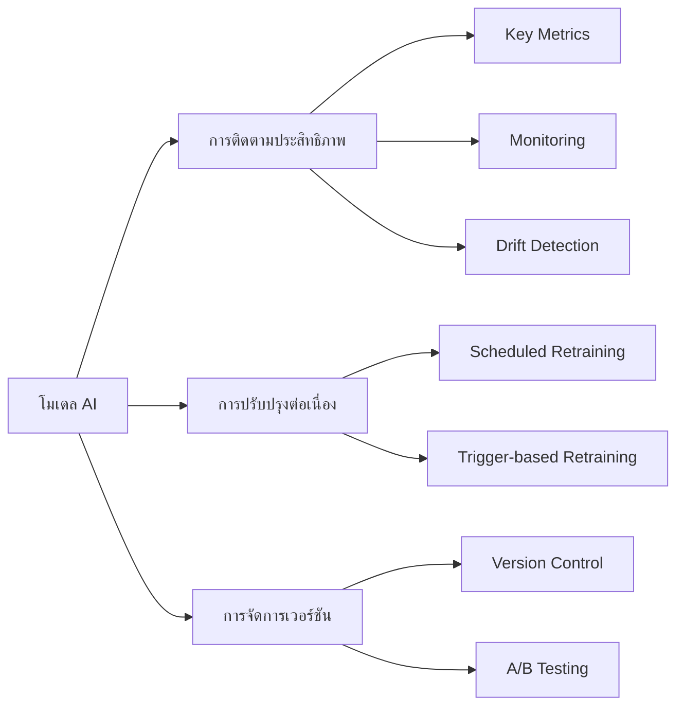

# แนวทางการดูแลโมเดล AI

การดูแลรักษาโมเดลให้ทำงานได้อย่างมีประสิทธิภาพในระยะยาวเป็นสิ่งสำคัญ

## Presenter Notes (ข้อมูลสำหรับผู้บรรยาย)

> Key Takeaway: โมเดล AI เมื่อถูกนำไปใช้งานจริงมักจะเสื่อมประสิทธิภาพลงเมื่อเวลาผ่านไป (model decay) เนื่องจากข้อมูลในโลกจริงมีการเปลี่ยนแปลงตลอดเวลา การวางระบบดูแลรักษาโมเดลจึงเป็นสิ่งสำคัญ ต้องมีการติดตามประสิทธิภาพอย่างสม่ำเสมอผ่าน key metrics ที่เหมาะสม มีระบบตรวจจับ drift เมื่อข้อมูลนำเข้าเปลี่ยนแปลงไป มีกระบวนการฝึกซ้ำ (retraining) ที่มีประสิทธิภาพ และมีการจัดการเวอร์ชันที่ดีเพื่อให้สามารถย้อนกลับไปใช้โมเดลเวอร์ชันก่อนหน้าได้หากจำเป็น แนะนำให้ใช้เครื่องมืออย่าง MLflow หรือ Weights & Biases ในการติดตามและจัดการโมเดล

> Technical Terms: Model Decay, Performance Monitoring, Drift Detection, Data Drift, Concept Drift, Retraining Pipeline, Model Registry, A/B Testing, Model Validation, Key Performance Indicators (KPIs)
