# AI Workshop - Complete Slides

## Table of Contents
- [Session 1: Modern AI Overview](#session-1-modern-ai-overview)
- [Session 2: n8n Automation](#session-2-n8n-automation)
- [Session 3: AI Agents](#session-3-ai-agents)
- [Session 4: RAG (Retrieval-Augmented Generation)](#session-4-rag-retrieval-augmented-generation)
- [Session 5: AI APIs and Integration](#session-5-ai-apis-and-integration)
- [Session 6: Open-WebUI และ Ollama](#session-6-open-webui-และ-ollama)
- [Session 7: Bolt Framework](#session-7-bolt-framework)
- [Session 8: Best Practices and Development Tools](#session-8-best-practices-and-development-tools)

# Session 1: Modern AI Overview

## Page 1-1: Modern AI Overview


### ภาพรวมเทคโนโลยี AI ยุคปัจจุบัน

- เทคโนโลยี AI ก้าวหน้าอย่างก้าวกระโดดในช่วงไม่กี่ปีที่ผ่านมา
- เปลี่ยนแปลงวิธีการทำงาน การแก้ปัญหา และการสร้างสรรค์ในหลากหลายอุตสาหกรรม
- ความสามารถทั้งด้านการเข้าใจภาษา (NLP) และการมองเห็น (Computer Vision)

### Presenter Notes (ข้อมูลสำหรับผู้บรรยาย)

> Key Takeaway: เน้นให้ผู้เรียนเข้าใจว่าปัจจุบัน AI ไม่ใช่เรื่องไกลตัวอีกต่อไป แต่เป็นเทคโนโลยีที่กำลังเปลี่ยนแปลงทุกภาคส่วน ทั้งธุรกิจ การศึกษา และชีวิตประจำวัน
>
> คำศัพท์เทคนิค: Artificial Intelligence (AI), Natural Language Processing (NLP), Computer Vision, Deep Learning
>
> เกริ่นนำถึงเนื้อหาที่จะเรียนในคอร์สนี้ โดยเริ่มจากภาพรวมไปจนถึงการประยุกต์ใช้งานจริง เน้นว่าการเข้าใจหลักการพื้นฐานจะช่วยให้สามารถประยุกต์ใช้เทคโนโลยี AI ได้อย่างมีประสิทธิภาพ

---

## Page 1-2: ปัจจัยสำคัญสู่ความก้าวหน้าของ AI


### ปัจจัยหลักที่ผลักดัน AI สู่จุดเปลี่ยน

- **การพัฒนาของ Deep Learning** - โครงข่ายประสาทเทียมที่ซับซ้อนขึ้น
- **พลังการประมวลผลที่เพิ่มขึ้น** - GPU และ TPU ประสิทธิภาพสูง
- **ข้อมูลมหาศาล** - Big Data สำหรับการฝึกฝนโมเดล
- **การเข้าถึงง่าย** - API และเครื่องมือสำหรับผู้ใช้ทั่วไป

### Presenter Notes (ข้อมูลสำหรับผู้บรรยาย)

> Key Takeaway: ความก้าวหน้าของ AI เกิดจากปัจจัยหลายด้านที่มาบรรจบกันในช่วงเวลาที่เหมาะสม ทำให้เกิดการเปลี่ยนแปลงแบบก้าวกระโดด
>
> คำศัพท์เทคนิค: Deep Learning, Neural Networks, GPU (Graphics Processing Units), TPU (Tensor Processing Units), Big Data, API (Application Programming Interface)
>
> อธิบายเพิ่มเติม:
> - Deep Learning เป็นเทคนิคที่ใช้โครงข่ายประสาทเทียมหลายชั้น ทำให้โมเดลสามารถเรียนรู้ feature ที่ซับซ้อนได้
> - GPU/TPU ช่วยเร่งการคำนวณแบบขนาน ทำให้การฝึกฝนโมเดลที่เคยใช้เวลาเป็นเดือนลดเหลือเพียงไม่กี่วัน
> - การมี API ทำให้ผู้ที่ไม่มีความรู้เชิงลึกด้าน AI สามารถนำไปใช้งานได้ง่าย

---

## Page 1-3: ตัวอย่าง AI ที่โดดเด่นในปัจจุบัน


### AI ที่เปลี่ยนแปลงวงการ

#### ChatGPT (OpenAI)
- โมเดลภาษาโต้ตอบแบบธรรมชาติ
- สร้างเนื้อหาหลากหลายรูปแบบ (บทความ, โค้ด, บทกวี)

#### Midjourney
- สร้างภาพจากคำอธิบาย (text-to-image)
- ภาพมีความละเอียดและสวยงามสูง

#### Stable Diffusion
- โมเดล open-source สร้างภาพจากข้อความ
- สามารถรันบนเครื่องส่วนบุคคล

### Presenter Notes (ข้อมูลสำหรับผู้บรรยาย)

> Key Takeaway: AI ที่เป็นที่รู้จักในปัจจุบันไม่เพียงแสดงความสามารถทางวิชาการ แต่ได้นำมาประยุกต์ใช้ในชีวิตจริงและธุรกิจแล้ว
>
> คำศัพท์เทคนิค: Language Model, Text-to-Image Generation, Open-source Model, API
>
> อธิบายเพิ่มเติม:
> - ChatGPT เป็นผลิตภัณฑ์ที่ได้จากโมเดล GPT ซึ่งมีหลายรุ่น เช่น GPT-3.5, GPT-4
> - Midjourney ใช้งานผ่าน Discord และเป็นบริการแบบมีค่าใช้จ่าย
> - Stable Diffusion เป็นทางเลือกแบบ open-source ที่สามารถดาวน์โหลดมาใช้งานได้ฟรี
> - แต่ละเทคโนโลยีมีจุดแข็งและข้อจำกัดต่างกัน ซึ่งผู้ใช้ควรเลือกให้เหมาะกับงาน

---

## Page 1-4: Generative AI และ LLMs


### Generative AI คืออะไร?

- ระบบ AI ที่**สร้างเนื้อหาใหม่ๆ** ได้ (ข้อความ, รูปภาพ, เสียง, วิดีโอ)
- เรียนรู้จากข้อมูลที่มีอยู่แล้วและสร้างผลงานที่ไม่เคยมีมาก่อนได้
- แตกต่างจาก AI แบบดั้งเดิมที่เน้นการวิเคราะห์หรือจัดหมวดหมู่ข้อมูล

### Large Language Models (LLMs)

- โมเดลภาษาขนาดใหญ่ที่ผ่านการฝึกฝนด้วยข้อมูลข้อความมหาศาล
- ความสามารถหลัก: เข้าใจภาษา, แก้ปัญหา, สร้างเนื้อหา, เขียนโค้ด
- ตัวอย่างโมเดลที่โดดเด่น: GPT-4, Claude, Llama 2, Gemini, DeepSeek

### Presenter Notes (ข้อมูลสำหรับผู้บรรยาย)

> Key Takeaway: Generative AI และ LLMs เป็นเทคโนโลยีที่เปลี่ยนโฉมหน้าวงการ AI จากเดิมที่เน้นการวิเคราะห์ข้อมูลมาเป็นการสร้างสรรค์เนื้อหาใหม่
>
> คำศัพท์เทคนิค: Generative AI, Large Language Models (LLMs), Tokens, Parameters, Training Data
>
> อธิบายเพิ่มเติม:
> - LLMs ถูกฝึกฝนด้วยข้อมูลข้อความมหาศาล ทำให้มีความเข้าใจภาษามนุษย์อย่างลึกซึ้ง
> - โมเดลเหล่านี้มีขนาดใหญ่มาก วัดจากจำนวน parameters ที่มีหลายพันล้านถึงหลายแสนล้านตัว
> - ความแตกต่างระหว่างโมเดลแต่ละตัวอยู่ที่ขนาด, ข้อมูลที่ใช้ฝึกสอน, สถาปัตยกรรม และการปรับแต่ง
> - ยิ่งโมเดลมีขนาดใหญ่ ยิ่งต้องใช้ทรัพยากรในการฝึกฝนและการใช้งานมาก แต่มักให้ผลลัพธ์ที่ดีกว่า

---

## Page 1-5: กระบวนการทำงานของ LLM


### กระบวนการพัฒนาโมเดล LLM

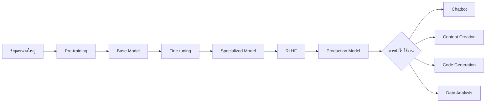

### ขั้นตอนหลัก
1. **Pre-training**: ฝึกโมเดลด้วยข้อมูลปริมาณมหาศาลเพื่อให้เข้าใจพื้นฐานของภาษา
2. **Fine-tuning**: ปรับแต่งโมเดลให้เชี่ยวชาญงานหรือโดเมนเฉพาะทาง
3. **RLHF**: พัฒนาโมเดลต่อยอดจากข้อเสนอแนะของมนุษย์

### Presenter Notes (ข้อมูลสำหรับผู้บรรยาย)

> Key Takeaway: การพัฒนา LLM เป็นกระบวนการหลายขั้นตอน เริ่มจากการฝึกฝนทั่วไป ตามด้วยการปรับแต่งเฉพาะทาง และสุดท้ายคือการปรับปรุงโดยมนุษย์
>
> คำศัพท์เทคนิค: Pre-training, Fine-tuning, RLHF (Reinforcement Learning from Human Feedback), Base Model, Specialized Model
>
> อธิบายเพิ่มเติม:
> - Pre-training คือการฝึกฝนด้วยข้อมูลจำนวนมหาศาล ทำให้โมเดลเข้าใจโครงสร้างภาษา แต่ยังไม่เฉพาะเจาะจงกับงานใด
> - Fine-tuning ใช้ข้อมูลเฉพาะทางจำนวนน้อยกว่าแต่มีคุณภาพสูง เพื่อให้โมเดลเชี่ยวชาญในงานเฉพาะด้าน
> - RLHF ใช้มนุษย์ช่วยในการประเมินและให้คะแนนคำตอบของโมเดล เพื่อปรับปรุงให้ตอบสนองได้ตรงความต้องการมากขึ้น
> - แต่ละขั้นตอนช่วยเพิ่มความสามารถของโมเดล แต่ก็เพิ่มต้นทุนและความซับซ้อนในการพัฒนา

---

# Session 2: n8n Automation

## Page 2-1: n8n Automation

### ภาพรวมระบบ Workflow Automation แบบ Open-Source


n8n เป็นเครื่องมือ workflow automation แบบ open-source ที่ช่วยให้เราสามารถเชื่อมต่อและอัตโนมัติกระบวนการทำงานระหว่างแอปพลิเคชันและบริการต่างๆ ได้โดยใช้แนวคิด "low-code"

### Presenter Notes (ข้อมูลสำหรับผู้บรรยาย)

> Key Takeaway: n8n เป็นเครื่องมือ automation ที่ไม่ต้องเสียค่าใช้จ่าย และใช้งานง่าย ไม่จำเป็นต้องมีทักษะการเขียนโค้ดมากนัก

- เน้นให้ผู้เรียนเห็นภาพรวมว่า n8n เป็นเครื่องมือที่จะช่วยเชื่อมต่อบริการต่างๆ เข้าด้วยกัน
- คล้ายกับ Zapier, Integromat (Make.com) แต่เป็น Open-source
- ถือเป็น "No-code/Low-code Platform" ที่กำลังเป็นที่นิยมในปัจจุบัน
- จุดเด่น: สามารถติดตั้งบนเครื่องของตัวเอง (self-hosted) ทำให้ข้อมูลไม่ต้องผ่านบริษัทภายนอก
- เหมาะสำหรับองค์กรที่ต้องการควบคุมข้อมูลเอง หรือมีข้อกังวลด้านความเป็นส่วนตัว

Technical Terms:
- Workflow Automation
- Open-source
- Low-code Platform
- Self-hosted
- Automation Nodes

---

## Page 2-2: วัตถุประสงค์การเรียนรู้


- เข้าใจแนวคิดของ Low-Code Workflow Automation
- สามารถติดตั้ง n8n ด้วย Docker Compose
- สร้าง workflow อัตโนมัติพื้นฐานได้
- เชื่อมต่อ n8n กับบริการภายนอก
- ใช้งาน n8n ร่วมกับเทคโนโลยี AI และ RAG

### Presenter Notes (ข้อมูลสำหรับผู้บรรยาย)

> Key Takeaway: เมื่อจบบทเรียนนี้ ผู้เรียนจะสามารถสร้างระบบอัตโนมัติได้ด้วยตัวเอง และเชื่อมต่อกับเทคโนโลยี AI

- อธิบายว่าการเรียนรู้จะเริ่มจากพื้นฐานไปสู่การประยุกต์ใช้ที่ซับซ้อนขึ้น
- วัตถุประสงค์เรียงตามลำดับการเรียนรู้ในบทเรียน
- เน้นย้ำว่าเป้าหมายสุดท้ายคือการนำ n8n ไปใช้ร่วมกับ AI โดยเฉพาะเทคนิค RAG
- ในตอนท้ายของคลาส จะมีการทำ workshop เพื่อให้เห็นภาพรวมของการใช้งานจริง
- ชี้แจงเพิ่มเติมว่าทักษะที่ได้สามารถนำไปต่อยอดกับงานอัตโนมัติในองค์กรได้จริง

Technical Terms:
- Low-Code Development
- Docker Compose
- Workflow Automation
- API Integration
- RAG (Retrieval-Augmented Generation)

---

## Page 2-3: แนวคิด Low-code Workflow Automation


Low-code workflow automation คือแนวคิดในการสร้างระบบอัตโนมัติโดยไม่จำเป็นต้องเขียนโค้ดมากนัก โดยใช้อินเตอร์เฟซแบบ visual interface ที่ช่วยให้ผู้ที่ไม่มีพื้นฐานการเขียนโปรแกรมสามารถสร้างระบบอัตโนมัติได้

### Presenter Notes (ข้อมูลสำหรับผู้บรรยาย)

> Key Takeaway: Low-code ช่วยลดช่องว่างระหว่างผู้ไม่มีทักษะการเขียนโค้ดกับความต้องการในการสร้างระบบอัตโนมัติ

- อธิบายว่า low-code เป็นแนวคิดที่ช่วยให้คนที่ไม่ใช่โปรแกรมเมอร์สามารถสร้างระบบได้
- มักใช้การลากวาง (drag and drop) components แทนการเขียนโค้ด
- มี visual interface ที่ช่วยให้เห็นภาพของ workflow ได้ชัดเจน
- ไม่ได้หมายความว่าไม่ต้องเขียนโค้ดเลย แต่เขียนน้อยลงมาก (บางครั้งอาจต้องเขียนโค้ดเล็กๆ น้อยๆ)
- สามารถพัฒนาโซลูชันได้รวดเร็วกว่าการเขียนโค้ดแบบดั้งเดิม
- ยกตัวอย่างเครื่องมือ low-code อื่นๆ เช่น Power Automate (Microsoft), Zapier, Make.com
- เหมาะสำหรับการทำ process automation, business workflows, data integration

Technical Terms:
- Low-code Development
- Visual Programming
- Workflow Designer
- Drag-and-drop Interface
- Business Process Automation (BPA)

---

## Page 2-4: ทำไมต้องเลือกใช้ n8n?

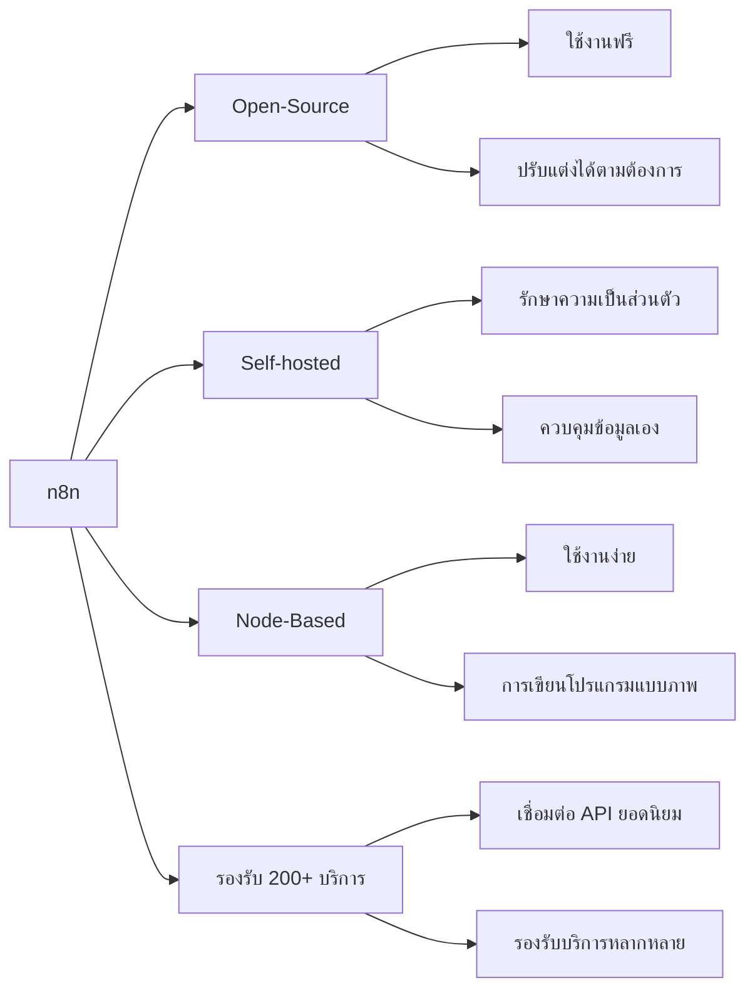

### Presenter Notes (ข้อมูลสำหรับผู้บรรยาย)

> Key Takeaway: n8n มีข้อได้เปรียบด้านความเป็น open-source, การควบคุมข้อมูล และความยืดหยุ่นในการใช้งาน

- อธิบายคุณสมบัติหลักของ n8n:
  1. **Open-Source**: ไม่มีค่าใช้จ่าย สามารถดูและแก้ไขโค้ดได้ มีชุมชนช่วยพัฒนา
  2. **Self-hosted**: ติดตั้งบนเซิร์ฟเวอร์ของตัวเอง ไม่ต้องส่งข้อมูลออกไปนอกองค์กร
  3. **Node-Based**: ใช้งานง่ายด้วยการเชื่อมต่อ nodes ที่เป็นภาพ
  4. **รองรับ 200+ บริการ**: Google Services, Social Media, CRM, Database และอื่นๆ
- เปรียบเทียบกับคู่แข่งเช่น Zapier (มีค่าใช้จ่าย ไม่สามารถเห็นการทำงานภายใน)
- เหมาะสำหรับองค์กรที่ต้องการควบคุมข้อมูลและมีความยืดหยุ่น
- มีลิมิตในการทำ workflow น้อยกว่าเมื่อเทียบกับแพลตฟอร์มเชิงพาณิชย์

Technical Terms:
- Open-source Software
- Self-hosted Solution
- Node-based Interface
- API Integration
- Fair-code Licensed

---

## Page 2-5: การติดตั้ง n8n ด้วย Docker Compose


```yaml
services:
  n8n:
    image: n8nio/n8n:latest
    ports:
      - "5678:5678"
    environment:
      - N8N_HOST=${N8N_HOST:-localhost}
      - N8N_PROTOCOL=${N8N_PROTOCOL:-http}
      # ส่วนอื่นๆ ตัดออกเพื่อความกระชับ
    volumes:
      - n8n_data:/home/node/.n8n
    depends_on:
      - postgres
```

### Presenter Notes (ข้อมูลสำหรับผู้บรรยาย)

> Key Takeaway: การใช้ Docker Compose ทำให้การติดตั้งและการจัดการ n8n เป็นเรื่องง่าย ไม่ต้องกังวลเรื่องการตั้งค่าสภาพแวดล้อมที่ซับซ้อน

- Docker Compose ช่วยให้เราสามารถสร้าง containers หลายตัวพร้อมๆ กันได้
- ในตัวอย่าง เรามี n8n และ postgres (สำหรับเก็บข้อมูล) ทำงานร่วมกัน
- อธิบายส่วนต่างๆ ในไฟล์ docker-compose.yml:
  - `image`: ระบุ image ที่จะใช้ ในที่นี้คือ n8nio/n8n:latest
  - `ports`: การ map port 5678 จาก container มายัง host
  - `environment`: ตัวแปรสภาพแวดล้อมที่จำเป็น
  - `volumes`: การเก็บข้อมูลแบบถาวร
  - `depends_on`: กำหนดลำดับการทำงาน ต้องรอ postgres พร้อมก่อน
- คำสั่งพื้นฐานที่ใช้:
  - `docker-compose up -d`: เริ่มการทำงาน
  - `docker-compose logs -f`: ดู logs
  - `docker-compose down`: หยุดการทำงาน
- เมื่อรัน n8n สำเร็จ สามารถเข้าใช้งานได้ที่ http://localhost:5678

Technical Terms:
- Docker
- Docker Compose
- Container
- Image
- Volume
- Port Mapping
- Environment Variables

---

## Page 2-6: การสร้าง Workflow พื้นฐาน


### ตัวอย่าง: รับข้อมูลจาก Google Sheet และส่งการแจ้งเตือนผ่าน Line

1. สร้าง Trigger ด้วย Schedule node (ทุก 1 ชั่วโมง)
2. เชื่อมต่อกับ Google Sheets node
3. ส่งข้อมูลไปยัง Line Notify node

### Presenter Notes (ข้อมูลสำหรับผู้บรรยาย)

> Key Takeaway: การสร้าง workflow ใน n8n เป็นเรื่องง่ายด้วยการเชื่อมต่อ nodes ต่างๆ เข้าด้วยกัน

- อธิบายว่า workflow ใน n8n ประกอบด้วย nodes ที่เชื่อมต่อกัน
- ในตัวอย่างนี้ เราใช้ 3 nodes หลัก:
  1. **Schedule node**: เป็น trigger ที่จะเริ่มทำงานตามเวลาที่กำหนด (ทุก 1 ชั่วโมง)
  2. **Google Sheets node**: ดึงข้อมูลจาก Google Sheet ที่กำหนด
  3. **Line Notify node**: ส่งข้อความแจ้งเตือนไปยัง Line
- แต่ละ node จะมีการตั้งค่าเฉพาะ:
  - Schedule: ตั้งเวลาการทำงาน (cron expression)
  - Google Sheets: การเชื่อมต่อ account, เลือก spreadsheet, sheet, range
  - Line Notify: เชื่อมต่อกับ Line token, กำหนดข้อความที่จะส่ง
- สามารถสร้าง workflow ที่ซับซ้อนมากขึ้นได้ เช่น:
  - เพิ่ม Filter node เพื่อกรองข้อมูล
  - ใช้ Function node เพื่อปรับแต่งข้อมูล
  - แยกการส่งข้อความตามเงื่อนไข
- เน้นย้ำว่าการทดสอบแต่ละ node สามารถทำได้ระหว่างสร้าง workflow

Technical Terms:
- Workflow
- Nodes
- Trigger
- Schedule (Cron Job)
- API Authentication
- Data Transformation
- Webhook

---

## Page 2-7: การใช้งาน n8n กับ RAG

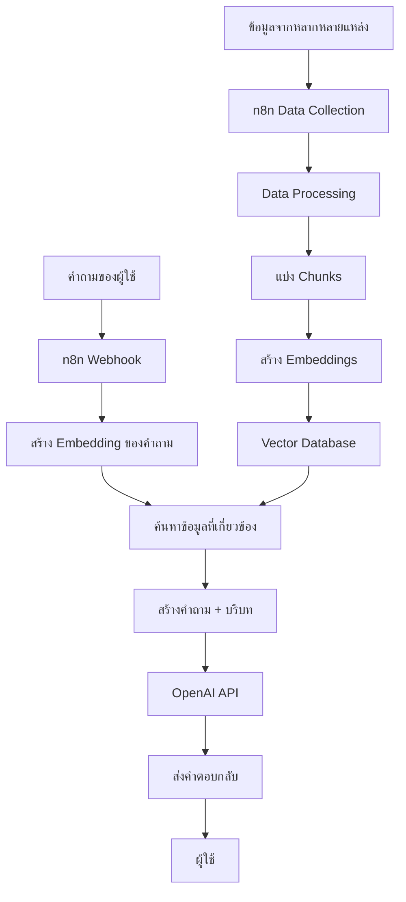

### Presenter Notes (ข้อมูลสำหรับผู้บรรยาย)

> Key Takeaway: n8n สามารถใช้เป็นเครื่องมือในการออกแบบและจัดการระบบ RAG ที่ซับซ้อนได้โดยไม่ต้องเขียนโค้ดมาก

- อธิบายว่า RAG (Retrieval-Augmented Generation) คือเทคนิคที่ช่วยให้ AI สามารถดึงข้อมูลที่เกี่ยวข้องมาใช้ในการตอบคำถาม
- จุดเด่นของการใช้ n8n กับ RAG:
  1. สามารถดึงข้อมูลจากหลายแหล่ง (PDF, เว็บไซต์, ฐานข้อมูล)
  2. จัดการกระบวนการแปลงข้อมูลในรูปแบบต่างๆ
  3. อัปเดตข้อมูลแบบอัตโนมัติตามตารางเวลา
  4. เชื่อมต่อกับ Vector DB เช่น ChromaDB, Pinecone, Weaviate
  5. สามารถสร้าง API endpoint สำหรับผู้ใช้
- อธิบายกระบวนการทำงานของ RAG ใน n8n ตามแผนภาพ:
  - ฝั่งซ้าย: กระบวนการ Ingestion (การนำเข้าและแปลงข้อมูล)
  - ฝั่งขวา: กระบวนการ Query (การค้นหาและตอบคำถาม)
- ประโยชน์: คำตอบมีความแม่นยำมากขึ้น อิงกับข้อมูลขององค์กร ลดการ hallucination ของ AI

Technical Terms:
- RAG (Retrieval-Augmented Generation)
- Embedding
- Vector Database
- Chunking
- Semantic Search
- Prompt Engineering
- Context Window

---

## Page 2-8: Workshop: ระบบ RAG ด้วย n8n


### การติดตั้ง n8n พร้อม Vector Database สำหรับระบบ RAG

```yaml
services:
  n8n:
    image: n8nio/n8n:latest
    # ... ตัดออกเพื่อความกระชับ
  postgres:
    image: postgres:14
    # ... ตัดออกเพื่อความกระชับ
  chroma:
    image: chromadb/chroma:latest
    container_name: chromadb
    ports:
      - "8000:8000"
    volumes:
      - chroma_data:/chroma/chroma
```

### Presenter Notes (ข้อมูลสำหรับผู้บรรยาย)

> Key Takeaway: การติดตั้งระบบ RAG แบบสมบูรณ์สามารถทำได้ง่ายด้วย Docker Compose โดยรวม n8n, Vector Database และบริการอื่นๆ ที่จำเป็น

- ในส่วน workshop นี้ เราจะติดตั้ง ecosystem สำหรับระบบ RAG ประกอบด้วย:
  1. **n8n**: สำหรับจัดการ workflow
  2. **PostgreSQL**: เป็นฐานข้อมูลสำหรับ n8n
  3. **ChromaDB**: เป็น Vector Database สำหรับเก็บ embeddings
- อธิบายขั้นตอนการติดตั้ง:
  1. สร้างไฟล์ docker-compose.yml ตามตัวอย่าง
  2. รันคำสั่ง `docker-compose up -d` เพื่อเริ่มการทำงาน
  3. ตรวจสอบการทำงานที่ port ต่างๆ:
     - n8n: http://localhost:5678
     - ChromaDB: http://localhost:8000
- ยกตัวอย่างการสร้าง workflow สำหรับ RAG:
  1. การดึงข้อมูลจากไฟล์เอกสาร (PDF, DOCX)
  2. การแปลงเป็นข้อความและแบ่งเป็น chunks
  3. การส่งข้อความไปสร้าง embeddings ด้วย OpenAI API
  4. การเก็บ embeddings ใน ChromaDB
  5. การสร้าง webhook สำหรับรับคำถาม
- จุดสำคัญ: การเชื่อมต่อกับ ChromaDB ผ่าน API จะใช้ HTTP Request node

Technical Terms:
- Docker Compose
- ChromaDB
- Vector Database
- Embeddings
- HTTP API
- Webhook
- Text Chunking
- Knowledge Base

---

# Session 3: AI Agents

## Page 3-1: AI Agent คืออะไร?


AI Agent คือระบบ AI ที่ไม่ได้เป็นเพียงแค่เครื่องมือที่ตอบสนองต่อคำสั่ง แต่สามารถ **"ลงมือทำ"** หรือ **"ดำเนินการ"** เพื่อบรรลุเป้าหมายได้อย่างอิสระมากขึ้น

### Presenter Notes (ข้อมูลสำหรับผู้บรรยาย)

> Key Takeaway: AI Agent แตกต่างจาก AI ทั่วไปตรงที่มีความสามารถในการตัดสินใจและดำเนินการด้วยตนเอง เพื่อบรรลุเป้าหมายที่กำหนดไว้

- อธิบายว่า AI Agent เป็นขั้นพัฒนาการต่อไปของเทคโนโลยี AI ที่มุ่งสู่ความเป็นอิสระมากขึ้น
- เปรียบเทียบแบบเข้าใจง่าย: AI ทั่วไปเหมือนคอมพิวเตอร์ที่รอคำสั่ง แต่ AI Agent เหมือนหุ่นยนต์ที่รู้ว่าต้องทำอะไรและทำอย่างไร
- คำว่า "Agent" มาจากแนวคิดด้าน "Agency" หรือความสามารถในการกระทำอย่างมีเป้าหมายชัดเจน
- AI Agent กำลังเป็นเทรนด์สำคัญในวงการ AI ปี 2024 เนื่องจากความสามารถที่เพิ่มขึ้นอย่างก้าวกระโดดของ LLM
- ตัวอย่าง AI Agent ที่เราอาจพบเจอในชีวิตประจำวัน เช่น บอทช่วยจองร้านอาหาร ผู้ช่วยเขียนโค้ด หรือระบบวิเคราะห์ตลาดหุ้นอัตโนมัติ

Technical Terms:
- Self-directed Execution
- AI Behavior

---

## Page 3-2: AI แบบ Reactive VS AI แบบ Agentic


### AI แบบ Reactive (ดั้งเดิม)
- ทำงานแบบตอบสนอง (Input -> Process -> Output)
- จำกัดอยู่ในขอบเขตของข้อมูลที่ถูกป้อนเข้ามา
- ไม่มีความสามารถในการเริ่มดำเนินการด้วยตนเอง

### AI แบบ Agentic (Agent)
- มีความเป็นอิสระในการตัดสินใจ (Autonomous)
- มีเป้าหมาย (Goal-oriented) และสามารถวางแผน
- สามารถโต้ตอบกับสภาพแวดล้อมและปรับตัวได้

### Presenter Notes (ข้อมูลสำหรับผู้บรรยาย)

> Key Takeaway: AI แบบ Agentic เป็นการยกระดับจาก AI แบบตอบสนอง (Reactive) ไปสู่ AI ที่มีความสามารถในการคิด วางแผน และลงมือทำเพื่อบรรลุเป้าหมาย

- ยกตัวอย่างเปรียบเทียบให้เห็นภาพ:
  - AI แบบ Reactive: เหมือนพนักงานที่รอคำสั่งจากหัวหน้า ทำเฉพาะตามที่บอก
  - AI แบบ Agentic: เหมือนผู้จัดการที่เมื่อได้รับเป้าหมาย สามารถคิดหาวิธี วางแผน และดำเนินการได้เอง
- AI แบบ Reactive เช่น: ChatGPT แบบทั่วไป, ระบบตรวจจับวัตถุในภาพ, ระบบแปลภาษา
- AI แบบ Agentic เช่น: AutoGPT, BabyAGI, ระบบผู้ช่วยที่ทำงานต่อเนื่องได้โดยไม่ต้องมีคำสั่งทุกขั้นตอน
- ชี้ให้เห็นว่าแนวโน้มในอนาคต AI จะเป็นแบบ Agentic มากขึ้น เพื่อลดการที่มนุษย์ต้องเข้าไปควบคุมทุกขั้นตอน
- ย้ำว่าการมีเป้าหมาย (Goal-oriented) เป็นลักษณะสำคัญที่ทำให้ AI Agent แตกต่าง

Technical Terms:
- Reactive AI
- Proactive AI
- Autonomous Decision Making
- Goal-oriented Systems
- Environment Interaction
- Adaptive Learning

---

## Page 3-3: องค์ประกอบหลักของ AI Agent

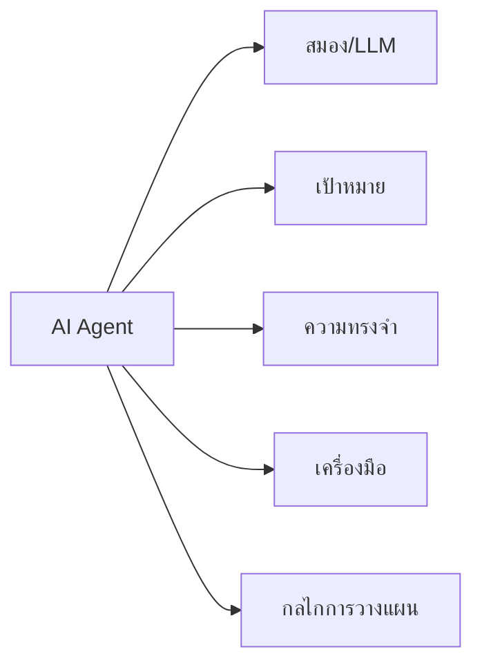

AI Agent ประกอบด้วย 5 องค์ประกอบหลักที่ทำงานร่วมกัน:

- **สมอง (Brain)**: โดยทั่วไปคือ LLM ที่ทำหน้าที่ประมวลผล คิดวิเคราะห์และตัดสินใจ
- **เป้าหมาย (Goal)**: วัตถุประสงค์ที่ชัดเจนว่าต้องการบรรลุอะไร
- **ความทรงจำ (Memory)**: ระบบจัดเก็บข้อมูลทั้งแบบระยะสั้นและระยะยาว
- **เครื่องมือ (Tools)**: ความสามารถในการใช้เครื่องมือหรือเชื่อมต่อกับ API ต่างๆ
- **กลไกการวางแผน (Planning)**: ความสามารถในการแบ่งงานเป็นขั้นตอนย่อยๆ

### Presenter Notes (ข้อมูลสำหรับผู้บรรยาย)

> Key Takeaway: AI Agent ที่มีประสิทธิภาพจำเป็นต้องมีองค์ประกอบทั้ง 5 ส่วนทำงานประสานกันอย่างลงตัว ขาดส่วนใดส่วนหนึ่งไม่ได้

- **สมอง (Brain)**: อธิบายว่าโดยทั่วไปคือ LLM เช่น GPT-4, Claude, Llama ที่มีความสามารถในการคิดวิเคราะห์ ให้เหตุผล 
  และประมวลผลข้อความ โดยเป็นส่วนที่ซับซ้อนที่สุดในระบบ

- **เป้าหมาย (Goal)**: เน้นย้ำว่าการกำหนดเป้าหมายที่ชัดเจนเป็นสิ่งสำคัญ โดยเป้าหมายต้องวัดผลได้ ทำได้จริง และมีขอบเขตที่เหมาะสม
  ตัวอย่างเป้าหมาย: "รวบรวมข้อมูลเกี่ยวกับยอดขายในไตรมาสล่าสุดและสรุปเป็นรายงาน"

- **ความทรงจำ (Memory)**: มี 2 ประเภท
  * Short-term memory: ข้อมูลในการสนทนาหรือการทำงานปัจจุบัน (เช่น context window)
  * Long-term memory: ข้อมูลที่จัดเก็บไว้ใช้ในอนาคต (มักใช้ vector database)

- **เครื่องมือ (Tools)**: ยกตัวอย่างเครื่องมือที่ AI Agent สามารถใช้ได้
  * API สำหรับค้นหาข้อมูล (Google Search, Wikipedia)
  * เครื่องมือจัดการไฟล์ (อ่าน/เขียนไฟล์ PDF, Excel)
  * API สำหรับจัดการข้อมูล (Database queries, REST APIs)
  * เครื่องมือการคำนวณ (คำนวณทางคณิตศาสตร์ที่ซับซ้อน)

- **กลไกการวางแผน (Planning)**: เปรียบเสมือนความสามารถในการ "คิดก่อนทำ" ช่วยให้ Agent จัดการกับงานที่ซับซ้อนได้อย่างมีประสิทธิภาพ

Technical Terms:
- Large Language Models (LLMs)
- Context Window
- Vector Database
- External Tool Integration
- Action Planning
- Task Decomposition
- Short-term Memory
- Long-term Memory

---

## Page 3-4: ระบบความจำของ AI Agent


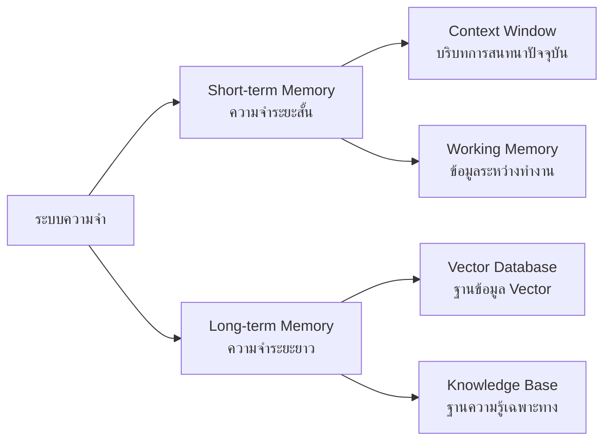

### Presenter Notes (ข้อมูลสำหรับผู้บรรยาย)

> Key Takeaway: ระบบความจำที่มีประสิทธิภาพช่วยให้ AI Agent สามารถจดจำบทสนทนา เรียนรู้จากประสบการณ์ และจัดเก็บข้อมูลเพื่อใช้งานในอนาคต

- **Short-term Memory (ความจำระยะสั้น)**:
  - Context Window: เป็นขีดจำกัดของข้อความที่ LLM สามารถ "จำ" ได้ในการสนทนา
  - ยกตัวอย่าง: GPT-4 มี context window ประมาณ 128,000 tokens (~100,000 คำ)
  - Working Memory: ข้อมูลที่ถูกใช้ระหว่างการทำงาน เช่น ตัวแปร ผลลัพธ์ชั่วคราว
  - ข้อจำกัด: มีขีดจำกัดในการเก็บข้อมูล เมื่อเกินก็จะลืมหรือต้อง "สรุป" เพื่อรักษาข้อมูลสำคัญ

- **Long-term Memory (ความจำระยะยาว)**:
  - เปรียบเสมือนห้องสมุดส่วนตัวของ AI Agent
  - มักใช้ Vector Database เช่น Pinecone, ChromaDB, Weaviate ในการจัดเก็บ
  - วิธีการทำงาน: แปลงข้อความเป็น embeddings (เวกเตอร์ตัวเลข) และจัดเก็บแบบค้นหาด้วยความคล้ายคลึง
  - เมื่อต้องการข้อมูล จะค้นหา embeddings ที่ใกล้เคียงกับคำถามหรือหัวข้อที่สนใจ
  - ช่วยให้ Agent จำได้ว่าเคยทำอะไรไปแล้ว เรียนรู้จากประสบการณ์เดิม

- **ความสำคัญของระบบความจำ**:
  - ช่วยให้การสนทนากับ AI มีความต่อเนื่อง น่าพึงพอใจ
  - เพิ่มความสามารถในการเรียนรู้และปรับตัว
  - ลดการทำงานซ้ำซ้อน
  - ช่วยให้ AI สามารถเข้าถึงข้อมูลได้มากขึ้นโดยไม่ต้องอยู่ใน context window

- **การประยุกต์ใช้ในงานจริง**:
  - Customer service bot ที่จำประวัติการสนทนากับลูกค้า
  - Personal assistant ที่เรียนรู้นิสัยและความชอบของผู้ใช้
  - Research agent ที่เก็บรวบรวมข้อมูลจากการค้นคว้า

Technical Terms:
- Context Window
- Token Limitation
- Embeddings
- Vector Database
- Semantic Search
- Memory Compression
- Information Retrieval
- Conversation History

---

## Page 3-5: เครื่องมือและกลไกการวางแผนของ AI Agent


### เครื่องมือ (Tools) สำหรับ AI Agent
- **API Integration**: เชื่อมต่อกับบริการภายนอกได้หลากหลาย
- **Search Capability**: ค้นหาข้อมูลจากแหล่งต่างๆ บนอินเทอร์เน็ต
- **File Operations**: อ่าน/เขียนไฟล์ได้หลายรูปแบบ เช่น PDF, CSV, Excel
- **Code Execution**: เขียนและรันโค้ดได้อัตโนมัติ
- **Calculation**: คำนวณตัวเลขที่ซับซ้อนหรือต้องการความแม่นยำสูง

### กลไกการวางแผน (Planning)
- **Task Decomposition**: แยกงานซับซ้อนเป็นขั้นตอนย่อยๆ
- **Sequence Ordering**: จัดลำดับขั้นตอนอย่างเหมาะสม
- **Error Handling**: รับมือกับความล้มเหลวและปรับแผน

### Presenter Notes (ข้อมูลสำหรับผู้บรรยาย)

> Key Takeaway: เครื่องมือและกลไกการวางแผนช่วยเพิ่มขีดความสามารถให้ AI Agent ทำงานได้หลากหลายและซับซ้อนมากขึ้น

- **เครื่องมือ (Tools)**:
  - อธิบายว่า Tools เป็นเสมือน "แขนขา" ที่ช่วยให้ AI Agent สามารถกระทำสิ่งต่างๆ ในโลกจริง
  - API Integration: ยกตัวอย่างการเชื่อมต่อกับ Google Calendar เพื่อจัดการตารางนัด, Slack เพื่อส่งข้อความ
  - Search: อธิบายความสำคัญของการค้นหาข้อมูลปัจจุบัน เช่น SerpAPI, Google Search API
  - File Operations: สาธิตประโยชน์ในการจัดการเอกสารองค์กร การดึงข้อมูลจาก PDF
  - Code Execution: แสดงให้เห็นว่า AI สามารถเขียนโค้ดและทดสอบได้ในสภาพแวดล้อมที่ปลอดภัย
  - Function Calling: เทคนิคที่ช่วยให้ AI เลือกใช้ฟังก์ชันที่เหมาะสมได้เอง

- **การวางแผน (Planning)**:
  - แนะนำเทคนิค Chain-of-Thought (CoT): การให้ AI คิดเป็นขั้นตอน
  - ReAct Pattern: วงจรการคิด (Reasoning) และการกระทำ (Acting)
  - แนะนำเทคนิค Tree-of-Thought: การพิจารณาทางเลือกหลายทางและเลือกทางที่ดีที่สุด
  - เน้นย้ำความสำคัญของการรับมือกับความล้มเหลว และการพยายามใหม่ด้วยวิธีการอื่น
  - อธิบายว่า Planning ที่ดีช่วยลด "hallucination" เพราะ AI มีโครงสร้างการคิดที่เป็นขั้นตอน

- **การผสมผสาน Tools และ Planning**:
  - อธิบายวิธีการที่ AI Agent เลือกใช้ Tools ที่เหมาะสมตามแผน
  - ยกตัวอย่าง: Agent ค้นหาข้อมูล → วิเคราะห์ → สร้างรายงาน → ส่งทางอีเมล
  - แสดงให้เห็นว่า Planning ที่ดีช่วยให้ใช้ Tools ได้อย่างมีประสิทธิภาพ

Technical Terms:
- API Integration
- Function Calling
- Chain-of-Thought (CoT)
- ReAct Pattern
- Tree-of-Thought
- Task Decomposition
- Error Handling and Retry Mechanisms
- Autonomous Tool Selection
- Code Interpreter

---

## Page 3-6: รูปแบบของ AI Agent


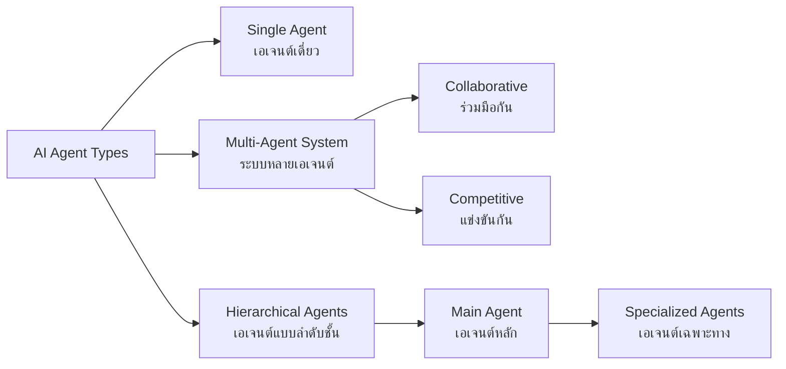

### Presenter Notes (ข้อมูลสำหรับผู้บรรยาย)

> Key Takeaway: การเลือกรูปแบบ AI Agent ที่เหมาะสมกับงานช่วยให้แก้ปัญหาได้มีประสิทธิภาพ โดยเฉพาะงานที่ซับซ้อนมักใช้ Multi-Agent System

- **Single Agent (เอเจนต์เดี่ยว)**:
  - เหมาะกับงานที่ไม่ซับซ้อนมาก มีขอบเขตชัดเจน
  - ข้อดี: บริหารจัดการง่าย ใช้ทรัพยากรน้อย ออกแบบไม่ซับซ้อน
  - ข้อจำกัด: อาจไม่เหมาะกับงานที่ต้องการความเชี่ยวชาญหลายด้าน
  - ตัวอย่าง: ผู้ช่วยตอบคำถาม, เครื่องมือสรุปเอกสาร, AI เขียนโค้ดอย่างง่าย

- **Multi-Agent System (ระบบหลายเอเจนต์)**:
  - **Collaborative (ร่วมมือกัน)**:
    - Agent หลายตัวทำงานร่วมกัน แต่ละตัวมีความเชี่ยวชาญต่างกัน
    - เหมาะกับงานที่ต้องการมุมมองหลากหลาย หรืองานที่แบ่งเป็นส่วนๆ ได้
    - ตัวอย่าง: ทีม AI วิจัยที่มี Agent ค้นหาข้อมูล, Agent วิเคราะห์ข้อมูล และ Agent สรุปผล
  
  - **Competitive (แข่งขันกัน)**:
    - Agent หลายตัวแข่งขันเพื่อหาวิธีแก้ปัญหาที่ดีที่สุด
    - ใช้ในการตรวจสอบคุณภาพ หรือมุมมองที่แตกต่างกัน
    - ตัวอย่าง: AI สำหรับเกม, ระบบวิเคราะห์ความเสี่ยง, การจำลองสถานการณ์ทางธุรกิจ

- **Hierarchical Agents (เอเจนต์แบบลำดับชั้น)**:
  - มี Main Agent ที่ทำหน้าที่มอบหมายงานและรวบรวมผลลัพธ์
  - Sub-agents ทำงานเฉพาะทางตามความเชี่ยวชาญ
  - เหมือนโครงสร้างองค์กรที่มี CEO และทีมงานเฉพาะด้าน
  - ตัวอย่าง: ระบบบริหารโครงการ AI, ผู้ช่วยผู้บริหารอัจฉริยะ

- **ตัวอย่าง Specialized Agents (เอเจนต์เฉพาะทาง)**:
  - Research Agent: เชี่ยวชาญการค้นคว้าและจัดการข้อมูล
  - Coding Agent: เชี่ยวชาญการเขียนและตรวจแก้โค้ด
  - Data Analysis Agent: เชี่ยวชาญวิเคราะห์และแสดงผลข้อมูล
  - Marketing Agent: เชี่ยวชาญด้านการตลาดและพฤติกรรมผู้บริโภค

- เล่าถึงแนวโน้มในอนาคตที่จะมีการพัฒนา "Society of AI Minds" หรือระบบที่มี AI จำนวนมากทำงานร่วมกันเหมือนสังคมมนุษย์

Technical Terms:
- Multi-Agent System (MAS)
- Agent Collaboration
- Agent Specialization
- Hierarchical Agent Structure
- Task Distribution
- Competitive Agents
- Consensus Building
- Society of AI Minds

---

## Page 3-7: เครื่องมือและเฟรมเวิร์กสำหรับพัฒนา AI Agent


### เฟรมเวิร์กยอดนิยมสำหรับสร้าง AI Agent

- **LangChain**: เฟรมเวิร์กอเนกประสงค์สำหรับเชื่อมต่อ LLM กับเครื่องมือหลากหลาย
- **AutoGPT**: ระบบ Autonomous GPT ที่ทำงานหลายขั้นตอนได้โดยอัตโนมัติ
- **Semantic Kernel**: เฟรมเวิร์กจาก Microsoft สำหรับผสานความสามารถของ AI เข้ากับแอปพลิเคชัน
- **AgentGPT**: แพลตฟอร์มบนเว็บสำหรับสร้าง AI Agent แบบอัตโนมัติ

### Presenter Notes (ข้อมูลสำหรับผู้บรรยาย)

> Key Takeaway: มีเฟรมเวิร์กมากมายที่ช่วยให้การสร้าง AI Agent ง่ายขึ้นโดยไม่ต้องเริ่มจากศูนย์ ควรเลือกใช้ตามความเหมาะสมกับโปรเจกต์และความถนัดของทีมพัฒนา

- **LangChain**:
  - เฟรมเวิร์กยอดนิยมที่สุดในปัจจุบัน รองรับทั้งภาษา Python และ JavaScript
  - จุดเด่น: มีโมดูล Memory, Tools และ Agent หลากหลาย
  - อธิบายโครงสร้าง LangChain: Chains (ลำดับการทำงาน) + Agents (การตัดสินใจ) + Tools (การเชื่อมต่อภายนอก)
  - เหมาะกับ: โปรเจกต์ที่ต้องการความยืดหยุ่น มีโมดูลให้เลือกใช้มากมาย
  - ตัวอย่างโค้ดสั้นๆ:
    ```python
    from langchain.agents import AgentType, initialize_agent
    from langchain.tools import DuckDuckGoSearchRun
    
    # สร้าง Agent ด้วย Tools และ LLM
    agent = initialize_agent(
        [DuckDuckGoSearchRun()], 
        llm, 
        agent=AgentType.ZERO_SHOT_REACT_DESCRIPTION,
        verbose=True
    )
    ```

- **AutoGPT**:
  - เน้นการทำงานแบบอิสระ (Autonomous) โดยมีการกำหนดเป้าหมายหลัก
  - วิธีทำงาน: Agent ตั้งเป้าหมายย่อย → วางแผน → ดำเนินการ → ประเมินผล → ปรับแผน
  - เหมาะสำหรับ: งานที่ต้องการความอิสระสูง การทำงานยาวนานโดยมนุษย์ไม่ต้องควบคุมทุกขั้นตอน
  - ให้ระวังการใช้งาน: มีการเรียกใช้ API บ่อยทำให้สิ้นเปลือง และอาจมี hallucination

- **Semantic Kernel**:
  - พัฒนาโดย Microsoft เน้นการผสาน AI เข้ากับแอปพลิเคชันที่มีอยู่
  - ใช้งานได้กับ C# และ Python ซึ่งเหมาะกับองค์กรที่ใช้เทคโนโลยี Microsoft
  - มีโครงสร้างแบบ "Skills" และ "Functions" ช่วยให้องค์กรมอง AI เป็นชุดความสามารถ

- **AgentGPT**:
  - เป็นแพลตฟอร์มบนเว็บที่ให้ผู้ใช้สร้าง AI Agent ได้โดยไม่ต้องเขียนโค้ด
  - เหมาะสำหรับ: การเริ่มต้น การทดลอง หรือผู้ที่ไม่ต้องการเขียนโค้ด
  - ข้อจำกัด: ความยืดหยุ่นน้อยกว่าการเขียนโค้ดเอง

- ย้ำว่าแต่ละเฟรมเวิร์กมีจุดแข็งและข้อจำกัด ควรเลือกให้เหมาะกับงานและทักษะของทีม
- แนะนำให้เริ่มจากเฟรมเวิร์กที่มีชุมชนสนับสนุนขนาดใหญ่ เช่น LangChain เพื่อหาแหล่งข้อมูลและตัวอย่างได้ง่าย

Technical Terms:
- Framework
- Agent Architecture
- LangChain
- AutoGPT
- Semantic Kernel
- AgentGPT
- Autonomous Agent
- Agent Templates
- Skills and Functions

---

## Page 3-8: วิธีสร้าง AI Agent


### ขั้นตอนการสร้าง AI Agent

1. **กำหนดเป้าหมายและขอบเขต**
   - ระบุสิ่งที่ Agent ควรทำได้และทำไม่ได้
   - กำหนดผลลัพธ์ที่คาดหวังอย่างชัดเจน

2. **ออกแบบ Prompt Template**
   - กำหนดบทบาท เป้าหมาย และความสามารถ
   - วางขั้นตอนการทำงานและกฎการทำงานที่ชัดเจน

3. **สร้างกระบวนการคิดและตัดสินใจ**
   - ใช้เทคนิค Chain of Thought, ReAct Pattern
   - กำหนดวิธีการวิเคราะห์และแก้ปัญหา

4. **เชื่อมต่อกับเครื่องมือภายนอก**
   - API, ฐานข้อมูล, เครื่องมือค้นหา

### Presenter Notes (ข้อมูลสำหรับผู้บรรยาย)

> Key Takeaway: การสร้าง AI Agent มีประสิทธิภาพต้องมีการออกแบบอย่างรอบคอบ ตั้งแต่การกำหนดเป้าหมาย, การสร้าง prompt ที่ดี, และการเชื่อมต่อกับ tools ที่เหมาะสม

- **1. การกำหนดเป้าหมายและขอบเขต**:
  - อธิบายความสำคัญของการกำหนดเป้าหมายที่ชัดเจน: "Agent นี้จะช่วยวิเคราะห์ข้อมูลลูกค้าและสรุปรายงานประจำเดือน"
  - แนะนำให้ระบุสิ่งที่ Agent ไม่ควรทำด้วย: "ไม่เปิดเผยข้อมูลลูกค้าส่วนตัว ไม่ตัดสินใจทางธุรกิจแทนมนุษย์"
  - เน้นการตั้งความคาดหวังที่เหมาะสม: Agent อาจไม่สามารถทำทุกอย่างได้สมบูรณ์ในครั้งแรก

- **2. การออกแบบ Prompt Template**:
  - แสดงตัวอย่าง prompt template ที่มีประสิทธิภาพ:
    ```
    คุณเป็น {agent_role} ที่เชี่ยวชาญด้าน {expertise}
    
    เป้าหมายของคุณ:
    1. {goal_1}
    2. {goal_2}
    
    ความสามารถของคุณ:
    1. {capability_1}
    2. {capability_2}
    
    ขั้นตอนการทำงานของคุณ:
    1. วิเคราะห์คำขอ
    2. วางแผนการทำงาน
    3. ใช้เครื่องมือที่เหมาะสม
    4. สรุปผลลัพธ์
    
    กฎการทำงาน:
    - {rule_1}
    - {rule_2}
    ```
  - อธิบายว่าการออกแบบ prompt ที่ดีเป็นศิลปะ ต้องอาศัยการทดลองและปรับปรุง
  - เน้นว่า prompt ควรชัดเจน มีโครงสร้าง และให้คำแนะนำเพียงพอแต่ไม่มากเกินไป

- **3. การสร้างกระบวนการคิดและตัดสินใจ**:
  - Chain of Thought (CoT): ให้ Agent แสดงการคิดเป็นขั้นตอน "คิดทีละขั้น"
  - ReAct Pattern: สลับระหว่างการให้เหตุผล (Reasoning) และการกระทำ (Acting)
  - ยกตัวอย่างแบบง่าย:
    1. คิด: "ฉันต้องการข้อมูลเกี่ยวกับยอดขายเดือนนี้"
    2. กระทำ: [ค้นหาข้อมูลจากฐานข้อมูล]
    3. คิด: "ฉันเห็นว่ายอดขายลดลง 5% ควรวิเคราะห์สาเหตุ"
    4. กระทำ: [วิเคราะห์ข้อมูลเพิ่มเติม]

- **4. การเชื่อมต่อกับเครื่องมือภายนอก**:
  - แนะนำวิธีการเชื่อมต่อ API โดยใช้ Function Calling
  - ยกตัวอย่าง:
    ```python
    tools = [
        {
            "type": "function",
            "function": {
                "name": "search_data",
                "description": "ค้นหาข้อมูลจากฐานข้อมูล",
                "parameters": {...}
            }
        }
    ]
    ```
  - อธิบายว่า Agent ที่มีประสิทธิภาพต้องรู้จักเลือกใช้เครื่องมือที่เหมาะสมกับงาน

- ย้ำว่าการสร้าง Agent เป็นกระบวนการที่ต้องทำซ้ำและปรับปรุง (iterative process) ไม่ใช่ทำครั้งเดียวเสร็จ

Technical Terms:
- Prompt Engineering
- Chain of Thought (CoT)
- ReAct Pattern
- Function Calling
- Tool Integration
- Agent Boundaries
- Iterative Development
- System Prompt

---

## Page 3-9: ตัวอย่างการใช้งานจริงของ AI Agent


### ตัวอย่างการนำไปใช้งานจริง

1. **แชทบอทอัจฉริยะ**
   - จองร้านอาหาร จองตั๋ว สั่งซื้อสินค้าได้โดยตรง
   - วิเคราะห์และแนะนำสินค้าตามพฤติกรรมและความชอบของผู้ใช้

2. **ผู้ช่วยส่วนตัวอัตโนมัติ**
   - จัดการตารางนัด ปฏิทิน อีเมลแบบครบวงจร
   - ช่วยเตรียมข้อมูลและเอกสารก่อนการประชุม

3. **ผู้ช่วยวิเคราะห์ข้อมูล**
   - วิเคราะห์ข้อมูลปริมาณมาก ค้นหาเทรนด์และข้อมูลเชิงลึก
   - สร้างรายงานและแดชบอร์ดแบบอัตโนมัติ

4. **ผู้ช่วยบริการลูกค้า**
   - ตอบคำถามทั่วไป แก้ปัญหาเบื้องต้นได้อย่างรวดเร็ว
   - คัดกรองและส่งต่อปัญหาซับซ้อนให้เจ้าหน้าที่มนุษย์

### Presenter Notes (ข้อมูลสำหรับผู้บรรยาย)

> Key Takeaway: AI Agent สามารถนำไปประยุกต์ใช้ได้หลากหลายทั้งในด้านอุตสาหกรรมและบทบาทหน้าที่ โดยเฉพาะงานที่ต้องจัดการข้อมูลจำนวนมาก การตัดสินใจตามกฎเกณฑ์ชัดเจน และการทำงานซ้ำๆ ที่ต้องการความแม่นยำ

- **1. แชทบอทอัจฉริยะ**:
  - ยกตัวอย่างกรณีศึกษา: ร้านอาหารที่ใช้ AI Agent รับจองโต๊ะผ่าน Line หรือ Facebook
  - สามารถเชื่อมต่อกับระบบจองคิวเดิม แต่เพิ่มความสามารถในการเข้าใจคำขอที่ซับซ้อน
  - สาธิต conversation flow:
    - ลูกค้า: "อยากจองโต๊ะสำหรับ 4 คน วันเสาร์หน้า ช่วงเย็นๆ มีโต๊ะริมหน้าต่างไหม?"
    - Agent: (ตรวจสอบตารางจอง) "มีโต๊ะว่างริมหน้าต่างวันเสาร์ที่ 15 เวลา 18.00 น. และ 20.00 น. คุณต้องการเวลาไหนคะ?"
  - ประโยชน์: ลดภาระพนักงาน ให้บริการ 24/7 เก็บข้อมูลพฤติกรรมลูกค้า

- **2. ผู้ช่วยส่วนตัวอัตโนมัติ**:
  - ยกตัวอย่าง AI Assistant สำหรับผู้บริหาร เช่น:
    - จัดลำดับความสำคัญของอีเมล แจ้งเตือนเรื่องสำคัญ
    - สรุปเอกสารและรายงานยาวๆ เป็นข้อความสั้นๆ
    - เตรียมข้อมูลสำหรับการประชุมล่วงหน้า
    - ติดตามและแจ้งเตือน deadline ของโปรเจกต์ต่างๆ
  - เล่ากรณีศึกษา: ผู้บริหารที่ประหยัดเวลาได้ 2-3 ชั่วโมงต่อวันด้วย AI Assistant

- **3. ผู้ช่วยวิเคราะห์ข้อมูล**:
  - อธิบายวิธีการที่ AI Agent สามารถช่วยงานวิเคราะห์ข้อมูล:
    - รวบรวมข้อมูลจากหลายแหล่ง (database, spreadsheets, APIs)
    - ทำความสะอาดและจัดรูปแบบข้อมูล
    - วิเคราะห์หาเทรนด์ ค่าผิดปกติ หรือความสัมพันธ์ในข้อมูล
    - สร้างรายงานและกราฟอัตโนมัติ
  - ตัวอย่าง: ฝ่ายการตลาดที่ใช้ Data Analysis Agent ติดตาม performance ของแคมเปญและปรับแผนอัตโนมัติ

- **4. ผู้ช่วยบริการลูกค้า**:
  - แสดงให้เห็นว่า AI Agent สามารถช่วยเพิ่มประสิทธิภาพงานบริการลูกค้าได้อย่างไร:
    - ตอบคำถามทั่วไปได้ทันที 24/7
    - ค้นหาข้อมูลจากฐานความรู้และคู่มือการใช้งาน
    - ติดตามสถานะคำสั่งซื้อ การส่งสินค้า หรือการคืนสินค้า
    - ประเมินแนวโน้มที่ปัญหาจะซับซ้อน และส่งต่อให้เจ้าหน้าที่มนุษย์ได้อย่างเหมาะสม
  - กรณีศึกษา: บริษัทที่ลดเวลาตอบสนองลูกค้าลง 60% ด้วย AI Customer Service Agent

- **กรณีศึกษาเพิ่มเติมสำหรับองค์กร IT**:
  - DevOps Agent: ช่วยตรวจจับและแก้ไขปัญหาในระบบอัตโนมัติ
  - Code Review Assistant: ตรวจสอบโค้ด แนะนำการปรับปรุง และหา bug
  - Documentation Generator: สร้างเอกสารประกอบโค้ดอัตโนมัติ
  - Security Monitoring Agent: เฝ้าระวังภัยคุกคามและช่องโหว่ด้านความปลอดภัย

Technical Terms:
- Natural Language Understanding
- Task Automation
- Data Analytics
- Business Intelligence
- Automated Reporting
- Customer Support Automation
- Ticket Prioritization
- Sentiment Analysis
- Intent Recognition

---

## Page 3-10: การเชื่อมต่อ Agent กับระบบอัตโนมัติ (เช่น n8n)


### แนวคิดการทำงานร่วมกัน

- **AI Agent = สมอง**: ทำหน้าที่คิด วิเคราะห์ ตัดสินใจ
- **n8n = แขนขา**: ทำหน้าที่ดำเนินการตามที่ Agent ตัดสินใจ

### ตัวอย่าง Workflow

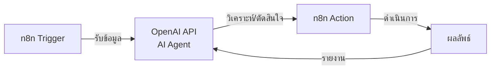

### Presenter Notes (ข้อมูลสำหรับผู้บรรยาย)

> Key Takeaway: การผสมผสาน AI Agent กับเครื่องมือการทำงานอัตโนมัติอย่าง n8n สร้างระบบที่ทั้งฉลาดและมีประสิทธิภาพสูง โดย AI ทำหน้าที่เป็นสมอง และเครื่องมือ automation ทำหน้าที่เป็นแขนขาในการทำงาน

- **อธิบายหลักการทำงานร่วมกัน**:
  - เปรียบเทียบให้เข้าใจง่าย: AI Agent เป็นเสมือนสมองที่คิดและตัดสินใจ ส่วน n8n เป็นเสมือนแขนขาที่ลงมือทำ
  - อธิบาย workflow พื้นฐานในแผนภาพ:
    1. **Trigger**: เหตุการณ์ที่เริ่มต้นกระบวนการ (เช่น อีเมลเข้า, การกรอกฟอร์ม, กำหนดเวลา)
    2. **AI Agent Processing**: ส่งข้อมูลให้ AI วิเคราะห์และตัดสินใจ
    3. **Action**: n8n ดำเนินการตามการตัดสินใจของ AI Agent
    4. **Feedback Loop**: รายงานผลลัพธ์กลับไปให้ AI Agent

- **ยกตัวอย่างการประยุกต์ใช้จริงในองค์กร IT**:
  
  1. **ระบบจัดการอีเมลอัจฉริยะ**:
     - Trigger: อีเมลเข้าใหม่ใน inbox
     - AI Agent: วิเคราะห์เนื้อหา จัดประเภท ประเมินความสำคัญ
     - n8n Action: จัดเก็บใน folder, แท็กอีเมล, ส่งต่อให้บุคคลที่เกี่ยวข้อง, สร้าง task ใน project management
     - ประโยชน์: ลดเวลาจัดการอีเมล เพิ่มประสิทธิภาพการตอบสนอง ไม่พลาดเรื่องสำคัญ
  
  2. **ระบบตรวจสอบและแก้ไขปัญหาเซิร์ฟเวอร์**:
     - Trigger: การแจ้งเตือนจาก monitoring system
     - AI Agent: วิเคราะห์ log, สาเหตุของปัญหา, และแนะนำวิธีแก้ไข
     - n8n Action: รันคำสั่งเพื่อแก้ไขปัญหา, รีสตาร์ทเซอร์วิส, สำรองข้อมูล
     - Feedback Loop: รายงานผลการแก้ไขและเรียนรู้จากสถานการณ์
     - ประโยชน์: ลดเวลา downtime, ลดภาระ DevOps Engineer
  
  3. **ระบบวิเคราะห์และรายงานข้อมูล**:
     - Trigger: ตามกำหนดเวลา (ทุกวัน/สัปดาห์/เดือน)
     - n8n Action 1: รวบรวมข้อมูลจากแหล่งต่างๆ (database, API, file storage)
     - AI Agent: วิเคราะห์ข้อมูล หาเทรนด์ แนวโน้ม ความผิดปกติ
     - n8n Action 2: สร้างรายงาน ส่งอีเมล แจ้งเตือนหากพบสิ่งผิดปกติ
     - ประโยชน์: ได้ insights โดยอัตโนมัติ ไม่ต้องทำรายงานด้วยมือ

- **คำแนะนำในการเริ่มต้นสร้างระบบ**:
  1. เริ่มจากระบบขนาดเล็ก แล้วค่อยขยาย
  2. ออกแบบให้มนุษย์สามารถแทรกแซงและตรวจสอบได้ (human-in-the-loop)
  3. มีระบบติดตามและประเมินผลการทำงาน
  4. เตรียมการรับมือกรณี AI ทำงานผิดพลาด

- **ข้อควรระวัง**:
  - การให้สิทธิ์มากเกินไปแก่ระบบอัตโนมัติ
  - การพึ่งพาระบบมากเกินไปโดยไม่มีการตรวจสอบ
  - ค่าใช้จ่าย API ที่อาจเพิ่มขึ้นหากมีการเรียกใช้บ่อย

Technical Terms:
- Automation Workflow
- Autonomous System
- Trigger Events
- Decision Node
- Action Node
- Feedback Loop
- System Integration
- Human-in-the-loop
- Machine-Human Collaboration
- Fail-safe Mechanisms

---

# Session 4: RAG (Retrieval-Augmented Generation)

## Page 4-1: Introduction to RAG


เทคนิค RAG ช่วยเพิ่มความสามารถและความแม่นยำให้กับระบบ AI โดยผสมผสานการค้นคืนข้อมูล (Retrieval) และการสร้างเนื้อหา (Generation)

### Presenter Notes (ข้อมูลสำหรับผู้บรรยาย)

> Key Takeaway: RAG เป็นเทคนิคที่ช่วยแก้ปัญหาหลักๆ ของ LLM แบบทั่วไป โดยเพิ่มความสามารถด้านข้อมูลเฉพาะทางและลดการสร้างข้อมูลที่ไม่ถูกต้อง เหมาะสำหรับองค์กรที่ต้องการใช้ AI กับข้อมูลภายในที่เป็นความลับหรือข้อมูลเฉพาะทาง

> Technical Terms: Retrieval-Augmented Generation, Information Retrieval, Content Generation, Vector Search

---

## Page 4-2: ข้อจำกัดของ LLMs แบบดั้งเดิม

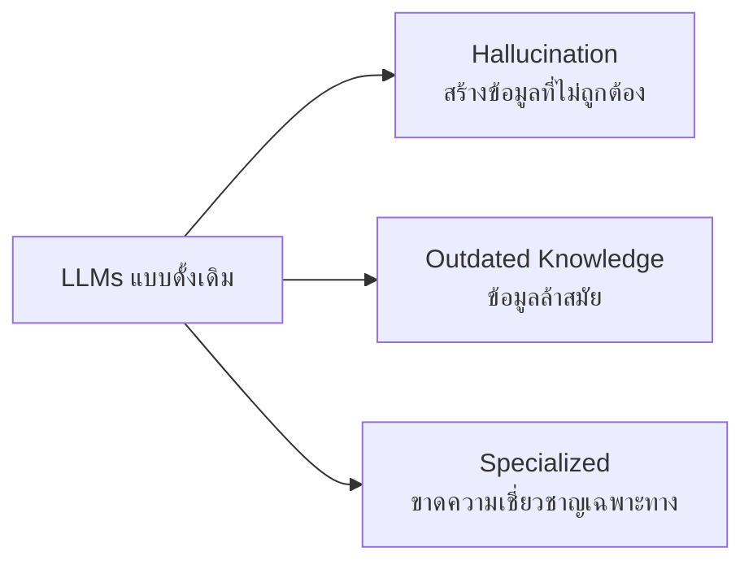

LLMs แบบดั้งเดิมมีข้อจำกัดสำคัญที่ส่งผลต่อการนำไปใช้งานจริงในองค์กร

### Presenter Notes (ข้อมูลสำหรับผู้บรรยาย)

> Key Takeaway: LLM แบบทั่วไปมีข้อจำกัดสำคัญ 3 ประการ ได้แก่: 1) Hallucination คือการสร้างข้อมูลที่ไม่ถูกต้องหรือไม่มีอยู่จริง 2) ข้อมูลล้าสมัย เนื่องจากถูกฝึกด้วยข้อมูลที่มีขอบเขตจำกัด 3) ขาดความเชี่ยวชาญเฉพาะทางในข้อมูลขององค์กร ทำให้ไม่สามารถตอบคำถามเฉพาะทางได้อย่างแม่นยำ ข้อจำกัดเหล่านี้เป็นสาเหตุที่ทำให้เราต้องใช้เทคนิค RAG

> Technical Terms: Hallucination, Outdated Knowledge, Domain-specific Knowledge, Knowledge Cutoff Date, Training Data

---

## Page 4-3: ประโยชน์ของระบบ RAG

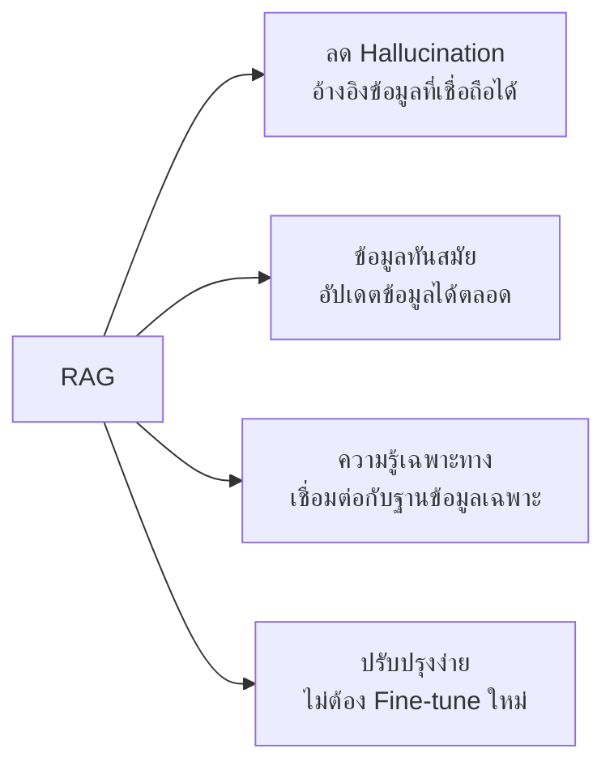

RAG ช่วยแก้ไขข้อจำกัดของโมเดล LLM แบบดั้งเดิมและเพิ่มประสิทธิภาพให้กับระบบ AI อย่างมาก

### Presenter Notes (ข้อมูลสำหรับผู้บรรยาย)

> Key Takeaway: RAG มีประโยชน์หลายประการที่สำคัญสำหรับการใช้งาน AI ในองค์กร: 1) ลดการ Hallucination โดยอ้างอิงข้อมูลจากแหล่งที่เชื่อถือได้ 2) ข้อมูลทันสมัย สามารถอัปเดตฐานข้อมูลได้โดยไม่ต้องฝึกโมเดลใหม่ 3) เพิ่มความรู้เฉพาะทางโดยเชื่อมต่อกับฐานข้อมูลขององค์กร 4) ปรับปรุงง่าย ไม่จำเป็นต้อง fine-tune โมเดลเมื่อต้องการเพิ่มความรู้ใหม่ เพียงแค่เพิ่มข้อมูลในฐานข้อมูล

> Technical Terms: Fact-based Responses, Ground Truth, Knowledge Base, Domain-specific Data, Fine-tuning Alternative

---

## Page 4-4: โครงสร้างของ RAG System

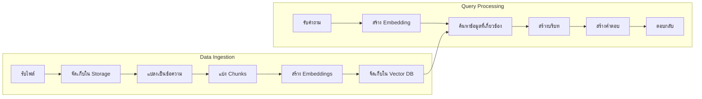

โครงสร้างของ RAG System ประกอบด้วย 2 กระบวนการหลัก: Data Ingestion และ Query Processing

### Presenter Notes (ข้อมูลสำหรับผู้บรรยาย)

> Key Takeaway: RAG System มีองค์ประกอบหลัก 2 ส่วน: 1) Data Ingestion คือการนำข้อมูลเข้าสู่ระบบ ประกอบด้วยการรับไฟล์ จัดเก็บ แปลงเป็นข้อความ แบ่งเป็นส่วนย่อย (chunks) สร้าง embeddings และจัดเก็บใน Vector Database 2) Query Processing คือกระบวนการประมวลผลคำถาม ประกอบด้วยการรับคำถาม สร้าง embedding ของคำถาม ค้นหาข้อมูลที่เกี่ยวข้อง สร้างบริบท นำไปสร้างคำตอบ และส่งกลับให้ผู้ใช้ ทั้งสองกระบวนการนี้ทำงานเชื่อมโยงกันผ่าน Vector Database ที่จัดเก็บ embeddings

> Technical Terms: Data Ingestion, Query Processing, Document Processing, Chunking, Embeddings, Vector Database, Semantic Search, Context Window, Prompt Engineering

---

## Page 4-5: การติดตั้ง RAG System ด้วย Docker Compose


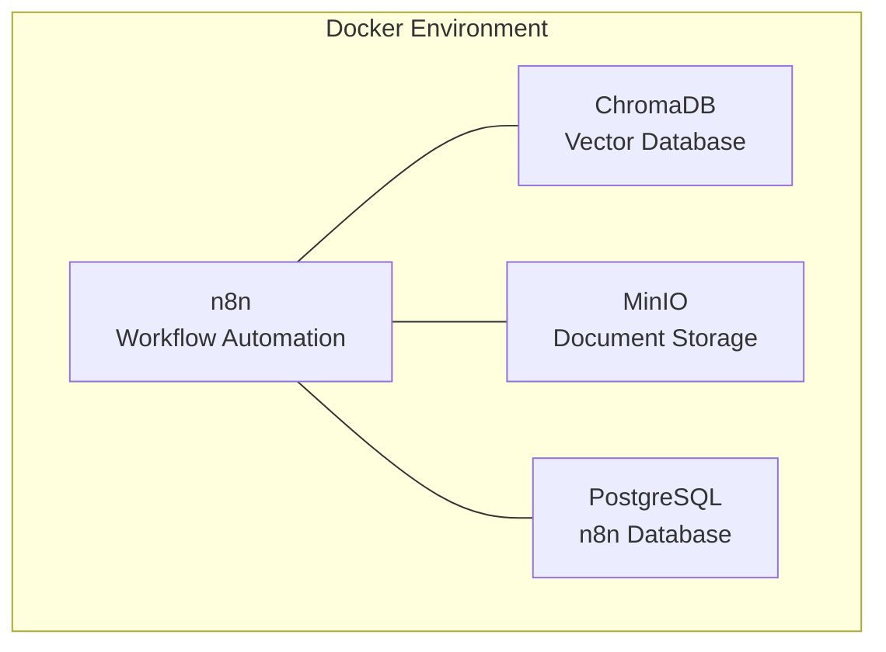

การติดตั้ง RAG System ด้วย Docker Compose ช่วยให้สามารถเริ่มต้นใช้งานได้อย่างรวดเร็ว

### Presenter Notes (ข้อมูลสำหรับผู้บรรยาย)

> Key Takeaway: เราจะใช้ Docker Compose เพื่อติดตั้งองค์ประกอบหลักทั้งหมดที่จำเป็นสำหรับ RAG System ได้แก่ 1) n8n สำหรับจัดการ workflow ทั้ง data ingestion และ query processing 2) ChromaDB เป็น vector database สำหรับเก็บ embeddings 3) MinIO สำหรับจัดเก็บไฟล์เอกสารต่างๆ เช่น PDF, DOCX 4) PostgreSQL สำหรับเก็บข้อมูลของ n8n เอง การใช้ Docker Compose ทำให้ไม่ต้องติดตั้งแต่ละส่วนแยกกัน และสามารถกำหนดค่าทั้งหมดได้ในไฟล์เดียว นอกจากนี้ยังสามารถปรับขนาดและกำหนดค่าแต่ละส่วนได้ตามต้องการ

> Technical Terms: Docker Compose, Container Orchestration, Service Configuration, Environment Variables, Network Configuration, Volume Management

---

## Page 4-6: กระบวนการนำเข้าข้อมูลใน n8n


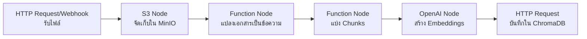

Workflow สำหรับนำข้อมูลเข้าสู่ระบบ RAG ใน n8n

### Presenter Notes (ข้อมูลสำหรับผู้บรรยาย)

> Key Takeaway: Data Ingestion Workflow ใน n8n มีขั้นตอนสำคัญดังนี้: 1) รับไฟล์เอกสารผ่าน HTTP Request หรือ Webhook node 2) จัดเก็บไฟล์ใน MinIO ด้วย S3 node เพื่อเก็บต้นฉบับไว้อ้างอิง 3) แปลงเอกสารเป็นข้อความด้วย Function node ซึ่งอาจใช้ไลบรารีเสริมเช่น pdf.js หรือ mammoth.js 4) แบ่งข้อความเป็นส่วนย่อย (chunks) เพื่อให้เหมาะสมกับการค้นหาและอยู่ในขนาดที่เหมาะสมกับ context window ของ LLM 5) สร้าง embeddings ด้วย OpenAI node 6) บันทึก embeddings ลงใน ChromaDB ผ่าน HTTP Request node นอกจากนี้ในแต่ละขั้นตอนสามารถเพิ่ม node สำหรับจัดการข้อผิดพลาด (Error Handling) หรือแปลงข้อมูลให้เหมาะสม (Data Transformation) ได้ตามต้องการ

> Technical Terms: Webhook, Document Parsing, Text Extraction, Chunking Strategies, Semantic Chunking, Embedding Generation, Vector Storage, S3 Compatible Storage

---

## Page 4-7: กระบวนการประมวลผลคำค้นหาใน n8n


Workflow สำหรับประมวลผลคำถามและสร้างคำตอบด้วย RAG ใน n8n

### Presenter Notes (ข้อมูลสำหรับผู้บรรยาย)

> Key Takeaway: กระบวนการประมวลผลคำค้นหาใน n8n มีขั้นตอนดังนี้: 1) รับคำถามจากผู้ใช้ผ่าน Webhook node 2) สร้าง embedding ของคำถามด้วย OpenAI node 3) ส่ง embedding ไปค้นหาข้อมูลที่เกี่ยวข้องใน ChromaDB ด้วย HTTP Request node 4) นำข้อมูลที่ได้มาสร้างบริบท (context) ด้วย Function node ซึ่งอาจรวมถึงการจัดรูปแบบข้อมูล การเรียงลำดับตามความเกี่ยวข้อง และการตัดข้อมูลให้พอดีกับขนาดที่เหมาะสม 5) ส่งคำถามพร้อมบริบทไปยัง OpenAI node เพื่อสร้างคำตอบ 6) ส่งคำตอบกลับไปยังผู้ใช้ผ่าน Respond to Webhook node ในขั้นตอนที่ 4 ควรพิจารณาใส่คำแนะนำ (prompt engineering) เพื่อให้ LLM สร้างคำตอบที่อ้างอิงจากบริบทที่ให้มาเท่านั้น และให้ระบุชัดเจนเมื่อไม่มีข้อมูลเพียงพอ

> Technical Terms: Query Embedding, Semantic Search, Context Construction, Vector Similarity, Top-k Retrieval, Prompt Engineering, Response Generation, RAG Prompt Template

---

## Page 4-8: การใช้งาน ChromaDB ใน RAG System


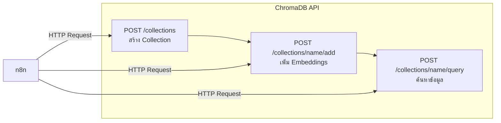

ChromaDB เป็น Vector Database ที่ใช้เก็บและค้นหา embeddings ใน RAG System

### Presenter Notes (ข้อมูลสำหรับผู้บรรยาย)

> Key Takeaway: ChromaDB เป็น Vector Database ที่มีประสิทธิภาพและใช้งานง่ายสำหรับ RAG System โดยมีการใช้งานผ่าน API หลัก 3 ส่วน: 1) การสร้าง Collection สำหรับจัดกลุ่มข้อมูล 2) การเพิ่ม Embeddings เพื่อจัดเก็บ vector representations ของข้อความพร้อมด้วย metadata และเนื้อหาต้นฉบับ 3) การ Query เพื่อค้นหาข้อมูลที่เกี่ยวข้องกับคำถาม โดยใช้ similarity search เพื่อหาเอกสารที่มีความหมายใกล้เคียงกับคำถาม การใช้งาน ChromaDB ผ่าน n8n จะใช้ HTTP Request node ในการส่งคำสั่ง API โดยตั้งค่า method, URL และ body ให้ถูกต้องตามข้อกำหนดของ ChromaDB API

> Technical Terms: Vector Database, Collection, Vector Embeddings, Metadata, Document Storage, Similarity Search, Cosine Similarity, L2 Distance, Vector Indexing, Approximate Nearest Neighbor (ANN) Search

---

## Page 4-9: การจัดการเอกสารด้วย MinIO


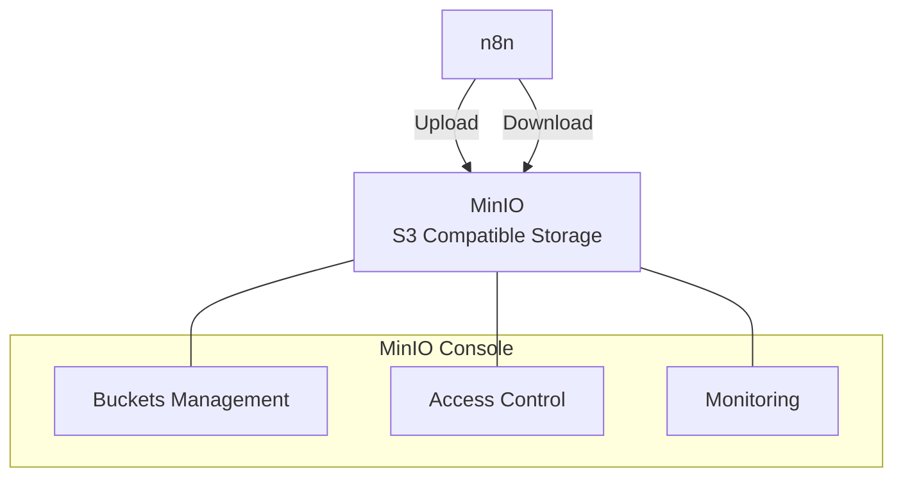

MinIO เป็น object storage ที่รองรับ S3 API สำหรับจัดเก็บเอกสารต้นฉบับใน RAG System

### Presenter Notes (ข้อมูลสำหรับผู้บรรยาย)

> Key Takeaway: MinIO เป็น object storage ระบบเปิดที่รองรับ Amazon S3 API ช่วยในการจัดเก็บเอกสารต้นฉบับในระบบ RAG โดยมีประโยชน์ดังนี้: 1) เก็บไฟล์ต้นฉบับไว้อ้างอิงในอนาคต 2) รองรับไฟล์หลากหลายประเภท เช่น PDF, DOCX, TXT 3) ปรับขนาดได้ตามความต้องการ 4) มีระบบจัดการสิทธิ์และความปลอดภัย การใช้งาน MinIO ใน n8n จะใช้ S3 node โดยตั้งค่าการเชื่อมต่อดังนี้: Host (minio), Port (9000), Access Key และ Secret Key จากการตั้งค่า MinIO และตั้งค่า Use SSL เป็น false สำหรับการใช้งานใน local การมี UI ของ MinIO ที่เข้าถึงได้ที่พอร์ต 9001 ทำให้สามารถจัดการไฟล์และตรวจสอบข้อมูลได้ง่าย

> Technical Terms: Object Storage, S3 Compatible Storage, Buckets, Access Keys, Object Lifecycle, Content-Type Detection, Multipart Upload, Pre-signed URLs

---

## Page 4-10: การเชื่อมต่อ OpenAI API เพื่อสร้าง Embeddings


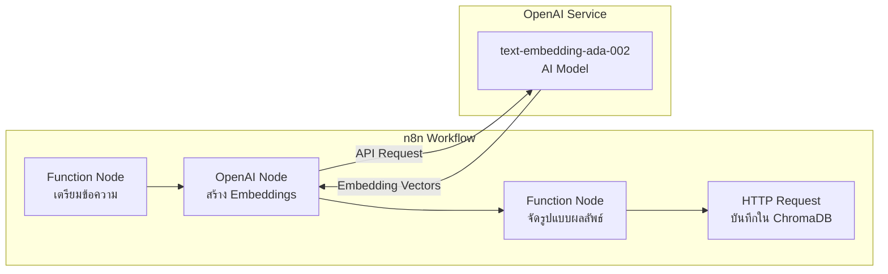

การเชื่อมต่อกับ OpenAI API เพื่อแปลงข้อความให้เป็น Embeddings สำหรับระบบ RAG

### Presenter Notes (ข้อมูลสำหรับผู้บรรยาย)

> Key Takeaway: การใช้ OpenAI API สำหรับสร้าง embeddings เป็นส่วนสำคัญของ RAG System ซึ่งใน n8n เราจะใช้ OpenAI node โดยมีขั้นตอนดังนี้: 1) ใช้ Function node เพื่อเตรียมข้อความที่จะส่งไปสร้าง embeddings โดยอาจต้องแปลงรูปแบบข้อมูลให้เหมาะสม 2) ตั้งค่า OpenAI node ให้ใช้ API key ที่ถูกต้องและเลือกโมเดล embedding เช่น text-embedding-ada-002 3) รับผลลัพธ์ที่เป็น vector และใช้ Function node อีกตัวเพื่อจัดรูปแบบก่อนส่งไปบันทึกใน ChromaDB ควรคำนึงถึงค่าใช้จ่ายในการใช้ OpenAI API ซึ่งคิดตามจำนวน tokens ที่ใช้ โดยโมเดล embedding มักจะมีราคาถูกกว่าโมเดล LLM ทั่วไป แต่เมื่อมีข้อมูลปริมาณมาก ค่าใช้จ่ายอาจสูงขึ้นได้

> Technical Terms: Embeddings, Vector Representation, text-embedding-ada-002, Dimensionality, Semantic Similarity, API Rate Limiting, Token Counting, Batch Processing, Cosine Similarity

---

# Session 5: AI APIs and Integration

## Page 5-1: ภาพรวมของ API สำหรับโมเดล AI


API (Application Programming Interface) ของโมเดล AI เปิดโอกาสให้นักพัฒนาสามารถ:
- เข้าถึงความสามารถของโมเดล AI ขั้นสูงผ่าน HTTP requests
- ผสานพลัง AI เข้ากับแอปพลิเคชันได้แบบยืดหยุ่น
- ใช้โมเดลที่ฝึกสอนมาอย่างดี โดยไม่ต้องสร้างเอง

### Presenter Notes (ข้อมูลสำหรับผู้บรรยาย)

> Key Takeaway: API คือสะพานเชื่อมระหว่างแอปพลิเคชันและโมเดล AI ทำให้นักพัฒนาสามารถใช้ความสามารถของ AI ได้โดยไม่ต้องมีความรู้ลึกเรื่องการสร้างและฝึกฝนโมเดล นี่คือสิ่งที่ทำให้การพัฒนาแอปพลิเคชัน AI กลายเป็นเรื่องที่เข้าถึงได้มากขึ้น แม้แต่กับทีมที่มีทรัพยากรจำกัด

> Technical Terms: Application Programming Interface (API), HTTP requests, Endpoints, Authentication, Rate limiting, Tokens

---

## Page 5-2: OpenAI API: รู้จักและเข้าใจ


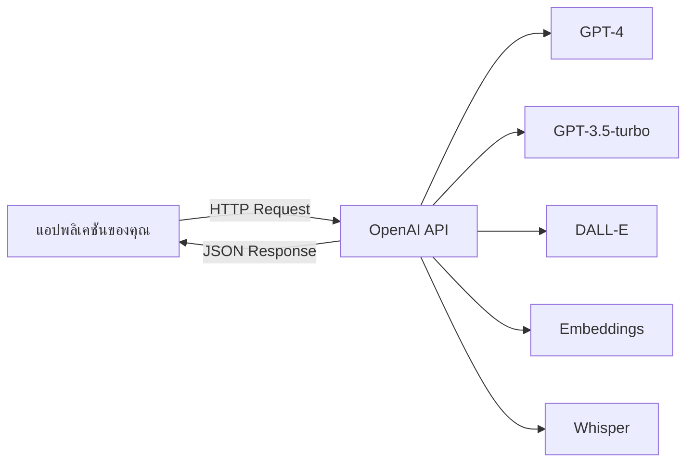

OpenAI API ให้บริการเข้าถึงโมเดล AI หลากหลายรูปแบบ:
- **ChatGPT/GPT-4**: สร้างข้อความและตอบคำถาม
- **DALL-E**: สร้างภาพจากคำอธิบาย
- **Whisper**: แปลงเสียงเป็นข้อความ
- **Embeddings**: สร้าง vector representations ของข้อความ

### Presenter Notes (ข้อมูลสำหรับผู้บรรยาย)

> Key Takeaway: OpenAI API เป็นหนึ่งในบริการ AI API ที่ได้รับความนิยมสูงสุดในปัจจุบัน เนื่องจากมีโมเดลที่หลากหลายและมีประสิทธิภาพสูง ทำให้นักพัฒนาสามารถเลือกใช้โมเดลที่เหมาะสมกับงานได้ ตั้งแต่การสร้างข้อความ ไปจนถึงการสร้างภาพหรือการประมวลผลเสียง การเข้าใจว่าแต่ละโมเดลเหมาะกับงานประเภทใดจะช่วยให้การพัฒนาแอปพลิเคชันมีประสิทธิภาพและประหยัดต้นทุน

> Technical Terms: GPT-4, GPT-3.5-turbo, DALL-E, Whisper, Embeddings, Vector representation, Tokens, Text generation, Image generation, Speech-to-text

---

## Page 5-3: การใช้งาน OpenAI API


### การติดตั้งและตั้งค่า:
1. สมัคร/ล็อกอินที่ platform.openai.com
2. สร้าง API Key
3. เติมเครดิต (หลังจากหมดช่วงทดลองใช้ฟรี)

### ตัวอย่างการใช้งานใน Python:
```python
import openai

client = openai.OpenAI(api_key="your-api-key")
completion = client.chat.completions.create(
  model="gpt-3.5-turbo",
  messages=[
    {"role": "system", "content": "คุณคือผู้ช่วย AI ที่เป็นประโยชน์"},
    {"role": "user", "content": "เขียนบทความสั้นๆ เกี่ยวกับประเทศไทย"}
  ]
)
print(completion.choices[0].message.content)
```

### Presenter Notes (ข้อมูลสำหรับผู้บรรยาย)

> Key Takeaway: การเริ่มต้นใช้งาน OpenAI API นั้นไม่ซับซ้อน เริ่มจากการสมัครและรับ API key จากนั้นเลือกใช้ SDK ในภาษาที่ต้องการ หรือเรียกใช้ API โดยตรงผ่าน HTTP requests ความเข้าใจเรื่องโครงสร้าง request และ response รวมถึงพารามิเตอร์ต่างๆ เช่น temperature และ max_tokens จะช่วยให้สามารถปรับแต่งผลลัพธ์ได้ตามต้องการ

> Technical Terms: API Key, SDK (Software Development Kit), HTTP Request, JSON, Temperature parameter, Max tokens, System message, User message, Completion, Role-based messaging

---

## Page 5-4: Gemini API: บริการ AI จาก Google


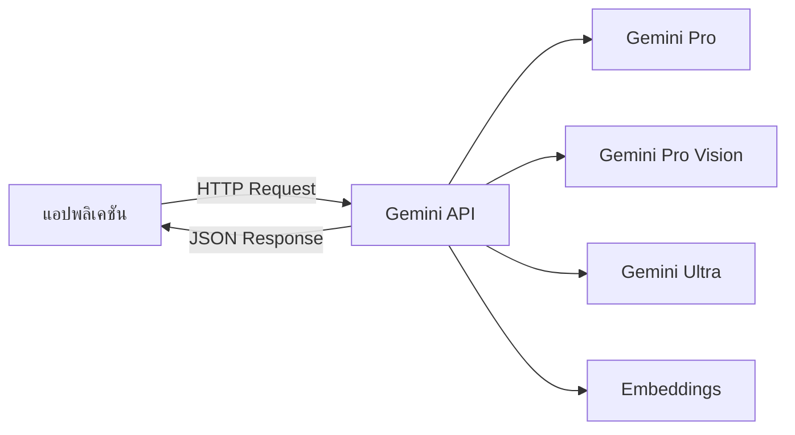

Gemini API เป็นบริการ AI จาก Google ที่มีจุดเด่น:
- **รองรับภาษาไทยได้ดีเยี่ยม**
- **มัลติโมดัล** (ข้อความ + รูปภาพ)
- **ราคาที่แข่งขันได้** (โควตาฟรี + ราคาต่อ token ที่ต่ำกว่า)
- **เชื่อมโยงกับบริการ Google อื่นๆ** ได้สะดวก

### Presenter Notes (ข้อมูลสำหรับผู้บรรยาย)

> Key Takeaway: Gemini API เป็นคู่แข่งสำคัญของ OpenAI API จากทาง Google โดยมีจุดเด่นที่ราคาที่แข่งขันได้และการรองรับภาษาไทยที่ดีเยี่ยม โมเดล Gemini Pro มีประสิทธิภาพใกล้เคียงกับ GPT-3.5 ในขณะที่ Gemini Pro Vision สามารถวิเคราะห์ทั้งข้อความและรูปภาพได้พร้อมกัน เหมาะสำหรับงานที่ต้องการความสามารถมัลติโมดัล และสำหรับองค์กรที่ต้องการประหยัดต้นทุนแต่ยังคงได้คุณภาพที่ดี

> Technical Terms: Multimodal AI, Vision-language model, Google AI Studio, Generative AI, API endpoints, Token pricing, Character-based billing

---

## Page 5-5: วิธีการใช้งาน Gemini API


### การติดตั้งและตั้งค่า:
1. สมัคร/ล็อกอินที่ aistudio.google.com
2. สร้าง API Key
3. เลือกแผนการใช้งาน (มีทั้งแบบฟรีและ Enterprise)

### ตัวอย่างการใช้งานใน Python:
```python
import google.generativeai as genai
import os

# ตั้งค่า API key
genai.configure(api_key=os.environ["GEMINI_API_KEY"])

# เรียกใช้โมเดล Gemini
model = genai.GenerativeModel('gemini-pro')

# สร้างคำตอบ
response = model.generate_content("เขียนโปรแกรม Python สำหรับคำนวณเลขฟีโบนัชชี")
print(response.text)
```

### Presenter Notes (ข้อมูลสำหรับผู้บรรยาย)

> Key Takeaway: Gemini API มีวิธีการใช้งานที่คล้ายคลึงกับ OpenAI API แต่มีรายละเอียดปลีกย่อยที่แตกต่างกันบ้างในเรื่องของ SDK และโครงสร้างของ request/response อย่างไรก็ตาม Google มีการพัฒนา SDK อย่างต่อเนื่องเพื่อให้ใช้งานได้ง่ายขึ้น และที่สำคัญคือ Gemini มีโควตาฟรีที่มากกว่า OpenAI ทำให้สามารถทดลองใช้งานได้มากขึ้นโดยไม่มีค่าใช้จ่าย สำหรับการใช้งานกับรูปภาพจำเป็นต้องใช้ Gemini Pro Vision ซึ่งมีวิธีการใช้งานที่แตกต่างออกไปเล็กน้อย

> Technical Terms: GoogleGenerativeAI, GenerativeModel, generate_content, API configuration, Content generation, Multimodal input, Streaming response

---

## Page 5-6: เปรียบเทียบ OpenAI API vs. Gemini API


| คุณลักษณะ | OpenAI | Google Gemini |
|----------|--------|----------|
| **โมเดลหลัก** | GPT-4, GPT-3.5-turbo | Gemini Pro, Pro Vision, Ultra |
| **จุดเด่น** | ความหลากหลายของโมเดล, ประสิทธิภาพสูง | ราคาที่แข่งขันได้, รองรับภาษาไทยดี |
| **การใช้งาน** | เข้าถึงง่าย, มี SDK หลายภาษา | ใช้งานง่าย, เชื่อมโยงกับบริการ Google |
| **ราคา** | ค่อนข้างสูงสำหรับโมเดลขั้นสูง | ราคาต่ำกว่า มีโควต้าฟรีมากกว่า |

### Presenter Notes (ข้อมูลสำหรับผู้บรรยาย)

> Key Takeaway: การเลือกระหว่าง OpenAI API และ Gemini API ขึ้นอยู่กับความต้องการเฉพาะของโปรเจกต์ OpenAI มีความได้เปรียบในแง่ของการมีโมเดลที่หลากหลายและมีประสิทธิภาพสูงกว่า โดยเฉพาะ GPT-4 ที่ยังเหนือกว่าในงานที่ซับซ้อน ในขณะที่ Gemini มีจุดเด่นด้านราคาที่ถูกกว่าและการรองรับภาษาไทยที่ดีกว่า องค์กรที่มีงบประมาณจำกัดหรือต้องการพัฒนาแอปพลิเคชันที่ใช้ภาษาไทยเป็นหลักอาจพิจารณา Gemini ก่อน แต่หากต้องการประสิทธิภาพสูงสุดและมีงบประมาณเพียงพอ OpenAI อาจเป็นตัวเลือกที่เหมาะสมกว่า

> Technical Terms: Model comparison, Pricing structure, Performance metrics, Feature parity, SDK availability, Integration capabilities, Token economics

---

## Page 5-7: ตัวอย่างโปรเจกต์ที่ใช้ AI API


### 1. แชทบอทให้คำปรึกษาด้านการเงิน
- ใช้ GPT-4 วิเคราะห์คำถามเกี่ยวกับการเงิน
- ให้คำแนะนำการลงทุนและวางแผนการเงินส่วนบุคคล
- เชื่อมต่อกับข้อมูลตลาดหุ้นแบบเรียลไทม์

### 2. ระบบสรุปเอกสารอัตโนมัติ
- ใช้ Gemini API สรุปเนื้อหาเอกสารยาวให้กระชับ
- ดึงประเด็นสำคัญและข้อสรุปหลัก
- สร้างรายงานสรุปสำหรับการประชุมอย่างรวดเร็ว

### 3. ผู้ช่วยสร้างเนื้อหาการตลาด
- สร้างไอเดียและเนื้อหาโฆษณาที่น่าสนใจ
- เขียนแคปชั่นและบทความโปรโมชันที่ดึงดูด
- แนะนำกลยุทธ์การตลาดดิจิทัลที่เหมาะสม

### Presenter Notes (ข้อมูลสำหรับผู้บรรยาย)

> Key Takeaway: ด้วยความสามารถของ AI API ทั้ง OpenAI และ Gemini สามารถนำไปพัฒนาเป็นโปรเจกต์ได้หลากหลาย ทั้งในด้านการให้คำปรึกษา การสรุปข้อมูล การสร้างเนื้อหา หรือแม้กระทั่งการวิเคราะห์ข้อมูลเชิงลึก สิ่งสำคัญคือการออกแบบ prompt ที่ดีและการประมวลผลข้อมูลก่อนส่งไปยัง API รวมถึงการกรองผลลัพธ์ที่ได้กลับมา เพื่อให้แอปพลิเคชันมีความแม่นยำและน่าเชื่อถือ อีกประเด็นสำคัญคือการเชื่อมต่อกับแหล่งข้อมูลภายนอกเพื่อเพิ่มความถูกต้องของข้อมูล โดยเฉพาะในกรณีที่ต้องการข้อมูลที่อัปเดตล่าสุด

> Technical Terms: Chatbot integration, Document summarization, Content generation, Real-time integration, Prompt engineering, Response filtering, API chaining, Context management, Data preprocessing

---

## Page 5-8: การบริหารจัดการค่าใช้จ่าย API


```mermaid
bar
    title ค่าใช้จ่ายโดยประมาณต่อ 1,000 tokens (USD)
    "GPT-3.5 Input": 0.0015
    "GPT-3.5 Output": 0.002
    "GPT-4 Input": 0.03
    "GPT-4 Output": 0.06
    "Gemini Pro Input": 0.00025
    "Gemini Pro Output": 0.0005
```

### วิธีลดค่าใช้จ่าย:
1. **เลือกโมเดลให้เหมาะกับงาน** - ไม่จำเป็นต้องใช้โมเดลที่ดีที่สุดเสมอไป
2. **จำกัดความยาวของ Input/Output** - ใช้ max_tokens อย่างเหมาะสม
3. **Caching** - จัดเก็บผลลัพธ์สำหรับคำถามที่พบบ่อย
4. **Batching** - รวม request หลายๆ อันเข้าด้วยกัน
5. **Streaming Response** - หยุดการสร้างเมื่อได้ข้อมูลที่ต้องการแล้ว

### Presenter Notes (ข้อมูลสำหรับผู้บรรยาย)

> Key Takeaway: การบริหารจัดการค่าใช้จ่าย API เป็นสิ่งสำคัญมากในการพัฒนาโปรเจกต์ AI เพราะค่าใช้จ่ายสามารถเพิ่มขึ้นอย่างรวดเร็วหากไม่มีการจัดการที่ดี การเลือกโมเดลที่เหมาะสมกับงานเป็นสิ่งสำคัญที่สุด ไม่ควรใช้ GPT-4 หากงานนั้นสามารถทำได้ดีด้วย GPT-3.5 หรือ Gemini Pro นอกจากนี้การใช้เทคนิคเช่น caching, batching และ streaming สามารถช่วยประหยัดค่าใช้จ่ายได้มาก รวมถึงการตั้งค่าการแจ้งเตือนและการจำกัดการใช้งานรายวันหรือรายเดือนเพื่อป้องกันค่าใช้จ่ายที่เกินคาดหมาย

> Technical Terms: Token economy, Cost optimization, Rate limiting, Request batching, Response streaming, Caching strategies, Usage alerts, Cost threshold, Budget allocation, Model downsizing

---

## Page 5-9: กรณีศึกษา: การใช้ AI API ในธุรกิจจริง


### 1. สตาร์ทอัพด้านการศึกษา
- **ปัญหา**: ครูมีเวลาจำกัดในการดูแลนักเรียนเป็นรายบุคคล
- **โซลูชัน**: สร้างระบบติวเตอร์อัจฉริยะด้วย OpenAI API
- **ผลลัพธ์**: ลดเวลาครูลง 40%, เพิ่มความเข้าใจของนักเรียน 25%

### 2. บริษัทจัดการเอกสารทางกฎหมาย
- **ปัญหา**: การวิเคราะห์สัญญาที่มีความซับซ้อนใช้เวลานาน
- **โซลูชัน**: ใช้ Gemini API วิเคราะห์และสรุปประเด็นสำคัญในสัญญา
- **ผลลัพธ์**: ลดเวลาการวิเคราะห์ลง 70%, เพิ่มความแม่นยำ

### Presenter Notes (ข้อมูลสำหรับผู้บรรยาย)

> Key Takeaway: กรณีศึกษาจากธุรกิจจริงแสดงให้เห็นว่า AI API สามารถสร้างผลกระทบเชิงบวกอย่างมีนัยสำคัญ ทั้งในแง่ของการเพิ่มประสิทธิภาพและลดต้นทุน ความสำเร็จของการนำ AI ไปใช้มักไม่ได้อยู่ที่เทคโนโลยีเพียงอย่างเดียว แต่รวมถึงการเข้าใจปัญหาธุรกิจอย่างลึกซึ้ง การออกแบบระบบที่ผู้ใช้สามารถใช้งานได้ง่าย และการพัฒนาแบบค่อยเป็นค่อยไป นอกจากนี้ การวัดผลเชิงปริมาณยังเป็นสิ่งสำคัญที่จะช่วยให้เห็นถึง ROI ที่ชัดเจนและช่วยในการตัดสินใจลงทุนเพิ่มเติมในเทคโนโลยี AI

> Technical Terms: ROI (Return on Investment), Productivity metrics, User adoption rate, Implementation strategy, Domain-specific AI, Vertical AI solutions, Custom fine-tuning, Integration architecture

---

## Page 5-10: Workshop: สร้างเครื่องมือสร้างเนื้อหาอัตโนมัติด้วย AI แบบง่ายๆ


### สิ่งที่เราจะสร้าง:
เว็บแอปพลิเคชันที่ใช้ OpenAI API สร้างเนื้อหาหลากหลายรูปแบบตามความต้องการ

### ฟีเจอร์:
- กำหนดหัวข้อ ประเภทเนื้อหา โทนเสียง และความยาวได้ตามต้องการ
- สร้างเนื้อหาโดยอัตโนมัติ
- คัดลอกและแก้ไขเนื้อหาที่สร้างได้ทันที

### เทคโนโลยีที่ใช้:
- Node.js + Express (Backend)
- HTML/CSS/JavaScript (Frontend)
- OpenAI API (GPT-3.5-turbo)

### Presenter Notes (ข้อมูลสำหรับผู้บรรยาย)

> Key Takeaway: Workshop นี้จะช่วยให้ผู้เรียนเห็นภาพรวมของการสร้างแอปพลิเคชันที่ใช้ AI API ตั้งแต่การออกแบบ frontend จนถึงการเชื่อมต่อกับ API และการประมวลผลข้อมูล เน้นความเข้าใจหลักการออกแบบ prompt ที่ดีเพื่อได้ผลลัพธ์ที่ตรงตามความต้องการ การสร้างเนื้อหาด้วย AI เป็นหนึ่งในการประยุกต์ใช้ที่พบบ่อยและสร้างมูลค่าได้สูง โดยเฉพาะในอุตสาหกรรมการตลาด สื่อ และอีคอมเมิร์ซ ทักษะจาก workshop นี้สามารถนำไปต่อยอดได้หลากหลาย เช่น สร้างระบบสร้างเนื้อหาอัตโนมัติ, ปรับแต่งเนื้อหาให้เหมาะกับกลุ่มเป้าหมาย, หรือแม้กระทั่งสร้างระบบให้คำแนะนำการเขียนเนื้อหา

> Technical Terms: Web application, Express framework, RESTful API, Content generation, Form handling, Prompt engineering, Response parsing, User experience design, Frontend-backend integration, Error handling

---

# Session 6: Open-WebUI และ Ollama

## Page 6-1: Open-WebUI และ Ollama


Open-WebUI และ Ollama เป็นเครื่องมือที่ช่วยให้คุณสามารถใช้งาน LLMs บนเครื่องของคุณเอง โดยไม่ต้องพึ่งพาบริการเชิงพาณิชย์อย่าง ChatGPT หรือ Claude API

### Presenter Notes (ข้อมูลสำหรับผู้บรรยาย)

> Key Takeaway: Open-WebUI และ Ollama เป็นคู่หูที่ทำให้การใช้งาน AI แบบ self-hosted เป็นเรื่องง่าย ช่วยให้องค์กรประหยัดค่าใช้จ่าย และมีความเป็นส่วนตัวสูง ไม่ต้องส่งข้อมูลไปยังบุคคลที่สาม โดย Ollama ทำหน้าที่เป็นตัวรัน LLM ส่วน Open-WebUI เป็น interface ที่ช่วยให้ใช้งานง่ายผ่านเว็บบราวเซอร์

> Technical Terms: Large Language Models (LLMs), Open-Source, Self-Hosting, Local Inference, Privacy-Preserving AI

---

## Page 6-2: คุณสมบัติหลักของ Open-WebUI


- อินเตอร์เฟซแบบแชทที่คล้าย ChatGPT
- รองรับหลายโมเดล AI ที่รันบน Ollama
- จัดการบทสนทนาและประวัติการใช้งาน
- ระบบ prompt templates สำหรับใช้งานซ้ำ
- ปรับแต่งพารามิเตอร์ของโมเดลได้

### Presenter Notes (ข้อมูลสำหรับผู้บรรยาย)

> Key Takeaway: Open-WebUI (เดิมชื่อ Ollama Web UI) ทำให้การใช้งาน LLMs เป็นเรื่องง่ายสำหรับทุกคน ไม่เพียงแค่มีหน้าตาสวยงาม แต่ยังมีฟีเจอร์ที่เป็นประโยชน์ เช่น การจัดเก็บและส่งออกประวัติการสนทนา การอัปโหลดไฟล์ (สำหรับโมเดล multi-modal) และการสร้างเทมเพลต การปรับแต่งพารามิเตอร์ต่างๆ เช่น temperature ช่วยให้ควบคุมความสร้างสรรค์ของ AI ได้

> Technical Terms: User Interface (UI), Chat History, Prompt Templates, Model Parameters, Temperature Settings, Context Length

---

## Page 6-3: การติดตั้งด้วย Docker Compose

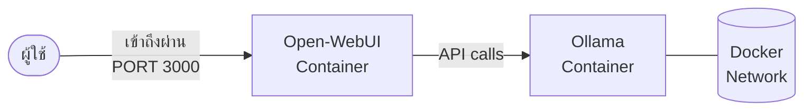

Docker Compose ช่วยให้การติดตั้งระบบทั้ง Open-WebUI และ Ollama ทำได้ง่ายเพียงแค่ไม่กี่ขั้นตอน

### Presenter Notes (ข้อมูลสำหรับผู้บรรยาย)

> Key Takeaway: การติดตั้งด้วย Docker Compose ทำให้การเริ่มต้นใช้งานเป็นเรื่องง่าย เพียงสร้างไฟล์ docker-compose.yml และรันคำสั่งเดียว โดยในไฟล์จะระบุการเชื่อมต่อระหว่าง container, การ map ports, การตั้งค่า volume สำหรับเก็บข้อมูล และการกำหนดค่า environment variables ต่างๆ นอกจากนี้ ยังสามารถเพิ่มการใช้งาน GPU ได้หากมี NVIDIA GPU โดยเพิ่มการตั้งค่า deploy resources ในส่วนของ Ollama container

---

## Page 6-4: Introduction to Ollama


Ollama คือเครื่องมือที่ช่วยให้คุณสามารถรัน LLMs ขนาดใหญ่บนเครื่องคอมพิวเตอร์ส่วนบุคคลได้อย่างง่ายดาย

### จุดเด่นของ Ollama
- **ง่ายต่อการใช้งาน** - ไม่จำเป็นต้องมีความรู้เชิงเทคนิคมาก
- **รองรับหลายโมเดล** - Llama, Mistral, Phi, Gemma และอื่นๆ
- **ประสิทธิภาพดี** - ทำงานได้ดีแม้บนคอมพิวเตอร์ทั่วไป
- **API ที่ใช้งานง่าย** - เชื่อมต่อกับแอปพลิเคชันอื่นได้

### Presenter Notes (ข้อมูลสำหรับผู้บรรยาย)

> Key Takeaway: Ollama เป็นเครื่องมือที่ทำให้การรัน LLMs บน local machine เป็นเรื่องง่าย เหมาะสำหรับทั้งนักพัฒนาและผู้ใช้ทั่วไป โดยจุดเด่นคือการที่ไม่จำเป็นต้องมีฮาร์ดแวร์ที่แพงมาก สามารถเริ่มต้นได้ด้วย CPU ทั่วไป (แม้จะช้ากว่า) และหากมี GPU ก็จะช่วยเร่งความเร็วได้มาก ด้วยการ quantize โมเดลลงมาเหลือขนาดที่เล็กลง ทำให้สามารถรันบน consumer hardware ได้โดยไม่เสียประสิทธิภาพมากนัก

> Technical Terms: Quantization, GGUF format, Local Inference, Model Downloading, Model Library

---

## Page 6-5: Installing and Using Ollama


### การติดตั้ง Ollama
- **macOS**: ดาวน์โหลดและติดตั้ง `.dmg` จากเว็บไซต์ Ollama
- **Windows**: ดาวน์โหลดและติดตั้ง installer จากเว็บไซต์ Ollama
- **Linux**: รันคำสั่ง `curl -fsSL https://ollama.com/install.sh | sh`

### การใช้งาน Ollama CLI

```bash
# ดาวน์โหลดและรันโมเดล
ollama run llama2

# ดูรายการโมเดลที่มี
ollama list

# ดูข้อมูลของโมเดล
ollama show llama2
```

### Presenter Notes (ข้อมูลสำหรับผู้บรรยาย)

> Key Takeaway: การติดตั้งและใช้งาน Ollama เป็นเรื่องที่ง่ายมาก เพียงแค่ติดตั้งตามขั้นตอนของแต่ละระบบปฏิบัติการ แล้วสั่งให้โปรแกรมดาวน์โหลดและรันโมเดลที่ต้องการผ่านคำสั่งเดียว เมื่อสั่งรันครั้งแรก Ollama จะดาวน์โหลดโมเดลมาเก็บไว้ในเครื่องก่อน จากนั้นจึงจะรันจากไฟล์ในเครื่อง ทำให้เร็วขึ้นในครั้งต่อไป ควรพิจารณาความต้องการและทรัพยากรที่มีก่อนเลือกโมเดล เช่น llama2 เหมาะสำหรับเครื่องทั่วไป ในขณะที่ mistral และ dolphin-mixtral ให้ผลลัพธ์ที่ดีกว่าแต่ต้องใช้ทรัพยากรมากกว่า

> Technical Terms: Command Line Interface (CLI), Model Pull, Model Execution, RAM Requirements, Model Registry

---

## Page 6-6: Ollama API


Ollama มี RESTful API ที่เรียบง่ายสำหรับใช้งานกับแอปพลิเคชันของคุณ

### API Endpoints หลัก

```
POST /api/generate      # สร้างข้อความโดยไม่เก็บบันทึกการสนทนา
POST /api/chat          # สร้างข้อความแบบต่อเนื่องเป็นบทสนทนา
POST /api/embeddings    # สร้าง vector embeddings จากข้อความ
GET  /api/tags          # รับรายชื่อโมเดลที่มีในระบบ
```

### ตัวอย่าง Request

```json
{
  "model": "llama2",
  "prompt": "คำถามของคุณคืออะไร?",
  "stream": true
}
```

### Presenter Notes (ข้อมูลสำหรับผู้บรรยาย)

> Key Takeaway: Ollama มี API ที่เรียบง่ายและใช้งานได้คล้ายกับ OpenAI API ทำให้นักพัฒนาสามารถสร้างแอปพลิเคชันที่ใช้งาน AI ได้โดยไม่ต้องส่งข้อมูลไปยังบริการภายนอก จุดเด่นคือการทำงานบนเครื่องของตัวเองทำให้ลดค่าใช้จ่าย API และควบคุมความเป็นส่วนตัวได้ดีกว่า การเข้าใจ endpoints หลักและพารามิเตอร์สำคัญเช่น temperature, top_p, และ system message จะช่วยให้สามารถปรับแต่งผลลัพธ์ได้ตามต้องการ

> Technical Terms: RESTful API, JSON Request/Response, Streaming Response, API Endpoints, Parameters, HTTP Methods

---

## Page 6-7: Using API with Programming Languages


### ตัวอย่างการใช้งานกับ Python

```python
import requests

response = requests.post('http://localhost:11434/api/generate', 
                        json={
                            'model': 'llama2',
                            'prompt': 'สวัสดี ช่วยแนะนำตัวหน่อย',
                            'stream': False
                        })

print(response.json()['response'])
```

### ตัวอย่างการใช้งานกับ JavaScript

```javascript
fetch('http://localhost:11434/api/generate', {
  method: 'POST',
  headers: {
    'Content-Type': 'application/json',
  },
  body: JSON.stringify({
    model: 'llama2',
    prompt: 'สวัสดี ช่วยแนะนำตัวหน่อย',
  }),
})
.then(response => response.json())
.then(data => console.log(data.response));
```

### Presenter Notes (ข้อมูลสำหรับผู้บรรยาย)

> Key Takeaway: การใช้ Ollama API กับภาษาโปรแกรมมิ่งต่างๆ ทำได้ง่าย เนื่องจากเป็น RESTful API มาตรฐาน ในแต่ละภาษาจะมีวิธีการเรียกใช้ HTTP requests ที่คล้ายกัน นอกจาก Python และ JavaScript ที่เห็นในตัวอย่าง ยังสามารถใช้กับภาษาอื่นๆ เช่น Go, Ruby, PHP หรือแม้แต่ Bash script ได้ ข้อควรระวังคือการตั้งค่า timeout ให้เหมาะสม เนื่องจากการสร้างข้อความด้วย LLM อาจใช้เวลานาน โดยเฉพาะเมื่อใช้งานบนเครื่องที่มีทรัพยากรจำกัด

> Technical Terms: HTTP Client, JSON Parsing, Asynchronous Requests, Timeout Configuration, Error Handling, Streaming Processing

---

## Page 6-8: Customizing Models with Modelfiles


Modelfile ช่วยให้คุณสามารถปรับแต่งโมเดล AI ได้ตามความต้องการ

### โครงสร้างของ Modelfile

```
FROM llama2
PARAMETER temperature 0.7
PARAMETER stop "STOP"
SYSTEM """คุณเป็นผู้เชี่ยวชาญด้านคอมพิวเตอร์ที่ชื่อ TechGuru 
คุณสามารถตอบคำถามเกี่ยวกับเทคโนโลยีได้เป็นอย่างดี
ตอบสั้น กระชับ และเป็นมิตร"""
```

### การสร้างโมเดลใหม่

```bash
# สร้างโมเดลจาก Modelfile
ollama create techguru -f ./Modelfile

# ใช้งานโมเดลที่สร้างขึ้น
ollama run techguru
```

### Presenter Notes (ข้อมูลสำหรับผู้บรรยาย)

> Key Takeaway: Modelfile เป็นเครื่องมือที่ทรงพลังใน Ollama ที่ช่วยให้ผู้ใช้สามารถปรับแต่งพฤติกรรมของโมเดลได้โดยไม่ต้องมีความรู้ในการ fine-tuning แบบลึกซึ้ง เหมือนการสร้าง "บุคลิก" หรือ "บทบาท" เฉพาะให้กับ AI โดยการกำหนดข้อความ SYSTEM และปรับค่าพารามิเตอร์ต่างๆ นอกจากนี้ยังสามารถใส่ข้อมูลเพิ่มเติม (ที่เรียกว่า LoRE - Low-Rank Expansion) เพื่อให้โมเดลมีความรู้เฉพาะทางมากขึ้น เช่น ข้อมูลบริษัท, เอกสารผลิตภัณฑ์ หรือคู่มือเฉพาะทาง

> Technical Terms: Modelfile, Base Model, System Prompt, Parameters Tuning, Template Variables, Temperature Setting, Custom Knowledge Base, Model Behavior Control

---

## Page 6-9: Custom Endpoints


คุณสามารถสร้าง Custom Endpoints เพื่อให้ระบบอื่นเชื่อมต่อกับ Ollama ผ่าน API ที่ออกแบบเองได้

### ตัวอย่างการสร้าง Endpoint ด้วย Python Flask

```python
from flask import Flask, request, jsonify
import requests

app = Flask(__name__)

@app.route('/api/translate', methods=['POST'])
def translate():
    text = request.json.get('text', '')
    target_lang = request.json.get('target', 'English')
    
    # เรียกใช้ Ollama API
    response = requests.post('http://localhost:11434/api/generate', 
        json={
            'model': 'llama2',
            'prompt': f'Translate the following text to {target_lang}: {text}',
            'stream': False
        })
    
    return jsonify({
        'original': text,
        'translated': response.json()['response'],
        'target_language': target_lang
    })

if __name__ == '__main__':
    app.run(port=3001)
```

### Presenter Notes (ข้อมูลสำหรับผู้บรรยาย)

> Key Takeaway: การสร้าง Custom Endpoints ช่วยให้สามารถปรับแต่ง API ให้เหมาะสมกับการใช้งานเฉพาะทาง ทำให้การเชื่อมต่อกับระบบอื่นๆ ง่ายขึ้น ตัวอย่างเช่น การสร้าง API สำหรับแปลภาษา วิเคราะห์อารมณ์ สรุปเนื้อหา หรือตอบคำถามเฉพาะด้าน โดยการสร้าง middleware ที่จัดการข้อมูลก่อนส่งไป Ollama และหลังจากได้รับคำตอบกลับมา ทำให้การใช้งานง่ายขึ้นสำหรับผู้ใช้ปลายทางและช่วยเพิ่มความปลอดภัยด้วยการจำกัดการเข้าถึงโมเดลโดยตรง

> Technical Terms: API Gateway, Middleware, Flask, Express.js, Input Validation, Response Formatting, Rate Limiting, Authentication, Business Logic Layer

---

## Page 6-10: Using Gemini API with Ollama


การใช้ Gemini API ร่วมกับ Ollama ช่วยให้เราได้ประโยชน์จากจุดแข็งของทั้งสองระบบ

### แนวคิดการใช้งานร่วมกัน

```mermaid
flowchart TD
    A[คำถามจากผู้ใช้] --> B{ตัดสินใจ}
    B -->|ต้องการข้อมูลล่าสุด<br>หรือความแม่นยำสูง| C[Gemini API]
    B -->|คำถามทั่วไป<br>หรือมีความอ่อนไหว| D[Ollama LLM]
    C --> E[ข้อมูลจากผู้ให้บริการ]
    D --> F[ข้อมูลจาก Local Model]
    E --> G[ตอบกลับผู้ใช้]
    F --> G
```

### Presenter Notes (ข้อมูลสำหรับผู้บรรยาย)

> Key Takeaway: การใช้งาน Hybrid AI System ที่ผสมผสานระหว่าง local models (Ollama) และ cloud services (Gemini API) ช่วยให้ได้ประโยชน์จากจุดแข็งของทั้งสองระบบ คือความเป็นส่วนตัวและการควบคุมข้อมูลจาก Ollama รวมกับความแม่นยำและข้อมูลที่ทันสมัยจาก Gemini API แนวทางนี้เหมาะสำหรับองค์กรที่ต้องการความยืดหยุ่นในการจัดการข้อมูลที่มีความอ่อนไหวแต่ในขณะเดียวกันก็ต้องการใช้ความสามารถของ AI รุ่นล่าสุด ตัวอย่างเช่น ใช้ Ollama สำหรับข้อมูลภายในองค์กร และใช้ Gemini API สำหรับข้อมูลทั่วไปหรือต้องการความสามารถพิเศษ เช่น การวิเคราะห์รูปภาพ

> Technical Terms: Hybrid AI System, Model Routing, Context-based Selection, Fallback Mechanism, Data Privacy Control, Cost Optimization, Capability Augmentation, System Architecture

---

# Session 7: Bolt Framework

## Page 7-1: Bolt Framework Introduction


Bolt Framework คือเฟรมเวิร์กสำหรับพัฒนาแอปพลิเคชันที่มีการผสานเทคโนโลยี AI ได้อย่างราบรื่น 
ช่วยให้นักพัฒนาสามารถสร้างแอปพลิเคชันที่ใช้ประโยชน์จาก AI ได้อย่างรวดเร็วและมีประสิทธิภาพ

### Presenter Notes (ข้อมูลสำหรับผู้บรรยาย)

> Key Takeaway: Bolt Framework เป็นเครื่องมือที่ช่วยลดความซับซ้อนในการบูรณาการ AI เข้ากับแอปพลิเคชัน โดยมุ่งเน้นที่การสร้างประสบการณ์การพัฒนาที่เรียบง่ายสำหรับนักพัฒนา

> Technical Terms: AI Integration Framework, Developer Experience, Application Development, AI Components

---

## Page 7-2: Bolt Framework Overview


```mermaid
graph TD
    A[แอปพลิเคชันของคุณ] --> B[Bolt Core]
    B --> C[AI Models]
    B --> D[Data Pipeline]
    B --> E[UI Components]
    B --> F[Security Layer]
```

Bolt Framework ประกอบด้วยองค์ประกอบหลักที่ช่วยให้การพัฒนาแอปพลิเคชัน AI เป็นไปได้อย่างรวดเร็ว

### Presenter Notes (ข้อมูลสำหรับผู้บรรยาย)

> Key Takeaway: Bolt Framework มีสถาปัตยกรรมแบบโมดูลาร์ที่ประกอบด้วยองค์ประกอบสำคัญ ได้แก่ Core Engine, AI Model Connectors, Data Processing Pipeline, UI Component Library และ Security Layer ทำให้นักพัฒนาสามารถเลือกใช้เฉพาะส่วนที่ต้องการได้

> Technical Terms: Modular Architecture, Component-based Development, API Integration, ML Pipeline, Frontend Framework

---

## Page 7-3: Learning Objectives


### เป้าหมายการเรียนรู้
- เข้าใจแนวคิดและสถาปัตยกรรมของ Bolt Framework
- สามารถติดตั้งและตั้งค่า Bolt Framework ได้
- สร้างแอปพลิเคชันพื้นฐานที่ใช้ AI ด้วย Bolt Framework
- เชื่อมต่อกับโมเดล AI หลากหลายประเภท
- ปรับแต่ง UI Components ตามความต้องการ

### Presenter Notes (ข้อมูลสำหรับผู้บรรยาย)

> Key Takeaway: เมื่อจบบทเรียนนี้ ผู้เรียนจะสามารถใช้ Bolt Framework เพื่อพัฒนาแอปพลิเคชันที่ผสานเทคโนโลยี AI ได้อย่างมีประสิทธิภาพ รวมถึงเข้าใจถึงจุดแข็งและข้อจำกัดของเฟรมเวิร์ก

> Technical Terms: Framework Installation, Configuration, AI Model Integration, Custom UI Components, Application Development

---

## Page 7-4: What is Bolt Framework?


### คุณสมบัติหลัก
- **AI-First Approach**: ออกแบบมาเพื่อรองรับการทำงานกับ AI โดยเฉพาะ
- **Model Agnostic**: เชื่อมต่อกับโมเดล AI ได้หลากหลาย (OpenAI, Gemini, Hugging Face, etc.)
- **Ready-made Components**: มี UI Components สำหรับงาน AI พร้อมใช้งาน
- **Scalable Architecture**: รองรับการขยายตัวของแอปพลิเคชันและโมเดล AI
- **Developer-friendly**: API ที่ใช้งานง่าย ลดความซับซ้อนในการพัฒนา

### Presenter Notes (ข้อมูลสำหรับผู้บรรยาย)

> Key Takeaway: Bolt Framework เป็นเฟรมเวิร์กที่พัฒนาขึ้นโดยมุ่งเน้นการทำงานกับ AI เป็นหลัก ทำให้มีคุณสมบัติที่เหมาะสมกับการพัฒนาแอปพลิเคชัน AI โดยเฉพาะ ทั้งยังมีความยืดหยุ่นสูงในการเชื่อมต่อกับโมเดล AI ต่างๆ

> Technical Terms: AI-First Development, Model Integration, Component Library, Scalability, Developer Experience, API Design

---

## Page 7-5: History and Features


### ประวัติและพัฒนาการ

- **2021**: เริ่มต้นพัฒนาเพื่อแก้ปัญหาการบูรณาการ AI กับแอปพลิเคชันแบบดั้งเดิม
- **2022**: เปิดตัวเวอร์ชัน 1.0 พร้อมคุณสมบัติพื้นฐานและการรองรับโมเดล NLP
- **2023**: เวอร์ชัน 2.0 เพิ่มการรองรับโมเดลภาพและเสียง พร้อม UI Components
- **2024**: เวอร์ชัน 3.0 รองรับ RAG และ AI Agent พร้อมปรับปรุงประสิทธิภาพ

### คุณสมบัติเด่น
- รองรับการทำงานแบบ Streaming Response
- มีระบบจัดการ Prompt Templates
- รองรับ Multi-modal Models
- มีเครื่องมือติดตามและวิเคราะห์การใช้งาน AI

### Presenter Notes (ข้อมูลสำหรับผู้บรรยาย)

> Key Takeaway: Bolt Framework มีการพัฒนาอย่างต่อเนื่องเพื่อตอบสนองต่อความก้าวหน้าของเทคโนโลยี AI โดยในแต่ละเวอร์ชันจะมีการเพิ่มความสามารถใหม่ๆ และปรับปรุงประสิทธิภาพให้ดียิ่งขึ้น

> Technical Terms: Framework Evolution, Version History, Feature Development, Streaming Response, Prompt Management, Multi-modal Support, Analytics Tools

---

## Page 7-6: Framework Comparison


| คุณสมบัติ | Bolt Framework | LangChain | LlamaIndex | Semantic Kernel |
|----------|---------------|-----------|------------|-----------------|
| **โฟกัส** | Full-stack AI Apps | LLM Orchestration | Data Indexing | AI Plugins |
| **UI Components** | ✅ | ❌ | ❌ | ⚠️ (Limited) |
| **ภาษาที่รองรับ** | JS, Python, Go | Python, JS | Python | .NET, Python, Java |
| **Learning Curve** | Medium | Steep | Medium | Steep |
| **Community Size** | Growing | Large | Medium | Medium |

### Presenter Notes (ข้อมูลสำหรับผู้บรรยาย)

> Key Takeaway: แต่ละเฟรมเวิร์กมีจุดแข็งและจุดอ่อนที่แตกต่างกัน Bolt Framework โดดเด่นในด้านการเป็น full-stack solution ที่มี UI components พร้อมใช้งาน ในขณะที่ LangChain เน้นการจัดการโมเดลภาษา LlamaIndex เน้นการจัดการข้อมูล และ Semantic Kernel เน้นการสร้างปลั๊กอิน AI การเลือกใช้เฟรมเวิร์กควรพิจารณาจากความต้องการของโปรเจกต์และทักษะของทีม

> Technical Terms: Framework Comparison, Full-stack Development, LLM Orchestration, Data Indexing, Plugin Architecture, Learning Curve, Community Support

---

## Page 7-7: Installation and Setup


### ขั้นตอนการติดตั้ง

```bash
# ติดตั้งผ่าน npm
npm install @bolt-framework/core

# ติดตั้ง UI components
npm install @bolt-framework/ui

# ติดตั้ง AI connectors
npm install @bolt-framework/ai-connectors
```

### การตั้งค่าพื้นฐาน

```javascript
// config.js
import { BoltCore } from '@bolt-framework/core';

const bolt = new BoltCore({
  apiKeys: {
    openai: process.env.OPENAI_API_KEY,
    gemini: process.env.GEMINI_API_KEY
  },
  settings: {
    logLevel: 'info',
    cacheEnabled: true
  }
});

export default bolt;
```

### Presenter Notes (ข้อมูลสำหรับผู้บรรยาย)

> Key Takeaway: การติดตั้ง Bolt Framework ทำได้อย่างง่ายดายผ่านตัวจัดการแพ็คเกจ npm สำหรับ JavaScript หรือ pip สำหรับ Python โดยแบ่งเป็นโมดูลต่างๆ ที่สามารถติดตั้งเฉพาะส่วนที่ต้องการได้ การตั้งค่าพื้นฐานรวมถึงการกำหนด API keys สำหรับบริการ AI ต่างๆ และค่าคอนฟิกอื่นๆ ตามความต้องการ

> Technical Terms: Package Installation, Configuration, API Keys, Environment Variables, Module Structure, Dependency Management, Initialization Settings

---

# Session 8: Best Practices and Development Tools

## Page 8-1: Tools and Best Practices Overview


### การพัฒนา AI อย่างมีประสิทธิภาพ

การพัฒนา AI ที่มีประสิทธิภาพต้องอาศัยการนำเครื่องมือที่เหมาะสมมาใช้ร่วมกับการปฏิบัติตามแนวทางที่ดีที่สุด เพื่อให้ได้ผลลัพธ์ที่แม่นยำ น่าเชื่อถือ และคุ้มค่าต่อการลงทุน

### แนวคิดหลักในการพัฒนา AI
- **Experiment Tracking**: การติดตามและบันทึกการทดลองทั้งหมด
- **Version Control**: การจัดการเวอร์ชันของโมเดลและข้อมูล
- **Reproducibility**: การสร้างโมเดลที่สามารถทำซ้ำได้
- **Automation**: การอัตโนมัติกระบวนการ ML/AI Pipeline
- **Monitoring**: การติดตามประสิทธิภาพของโมเดลในการใช้งานจริง

### Presenter Notes (ข้อมูลสำหรับผู้บรรยาย)

> Key Takeaway: การพัฒนา AI ที่ดีไม่ได้เกี่ยวกับการใช้อัลกอริทึมที่ซับซ้อนเพียงอย่างเดียว แต่เกี่ยวกับกระบวนการ การจัดการ และการใช้เครื่องมือที่เหมาะสมเพื่อให้โครงการ AI ประสบความสำเร็จในระยะยาว

> Technical Terms: MLOps, Model Registry, Experiment Tracking, CI/CD for ML, Reproducibility, Model Monitoring, Technical Debt

---

## Page 8-2: Additional Development Tools


### เครื่องมือที่มีประโยชน์สำหรับการพัฒนา AI

```mermaid
graph TD
    A[AI Development Tools] --> B[Model Tracking]
    A --> C[Experiment Management]
    A --> D[Data Versioning]
    A --> E[Model Serving]
    A --> F[Monitoring & Observability]
    
    B --> B1[MLflow]
    B --> B2[Weights & Biases]
    
    C --> C1[Comet.ml]
    C --> C2[Neptune.ai]
    
    D --> D1[DVC]
    D --> D2[LakeFS]
    
    E --> E1[TensorFlow Serving]
    E --> E2[Seldon Core]
    
    F --> F1[Prometheus]
    F --> F2[Grafana]
```

### ประเภทของเครื่องมือ

1. **Experiment Tracking**
   - **MLflow**: บันทึกการทดลอง พารามิเตอร์ และผลลัพธ์
   - **Weights & Biases**: ติดตามการทดลองพร้อมการแสดงผลแบบ Interactive

2. **Data & Model Versioning**
   - **DVC (Data Version Control)**: จัดการเวอร์ชันข้อมูลและโมเดล
   - **Git LFS**: สำหรับจัดเก็บไฟล์ขนาดใหญ่ใน Git

3. **Model Serving & Deployment**
   - **FastAPI**: สร้าง API สำหรับโมเดล ML อย่างรวดเร็ว
   - **BentoML**: แพ็คเกจและให้บริการโมเดล ML แบบ Unified

### Presenter Notes (ข้อมูลสำหรับผู้บรรยาย)

> Key Takeaway: การใช้เครื่องมือเฉพาะทางสำหรับ AI และ MLOps ช่วยให้ทีมสามารถจัดการความซับซ้อนของโครงการ AI ได้ดียิ่งขึ้น แต่ละเครื่องมือมีจุดเด่นต่างกัน การเลือกใช้ควรพิจารณาตามขนาดของทีม ความซับซ้อนของโครงการ และลักษณะการใช้งาน

> Technical Terms: Experiment Tracking, Hyperparameter Optimization, Model Registry, Feature Store, A/B Testing, CI/CD for ML, Scalable Model Serving, Containerization

---

## Page 8-3: Model Maintenance and Monitoring


### การดูแลรักษาและเฝ้าติดตามโมเดล AI

การใช้งานโมเดล AI ในการผลิตไม่ได้สิ้นสุดที่การ deploy โมเดลครั้งแรกเท่านั้น แต่ต้องมีการติดตาม ประเมิน และปรับปรุงอย่างต่อเนื่อง

### Data Drift และ Concept Drift

```mermaid
graph LR
    A[Model Performance] -->|ลดลงเมื่อเวลาผ่านไป| B{สาเหตุ}
    B -->|ข้อมูลเปลี่ยนแปลง| C[Data Drift]
    B -->|ความสัมพันธ์เปลี่ยนแปลง| D[Concept Drift]
    C --> E[ปรับปรุงโมเดลใหม่]
    D --> E
```

### ตัวชี้วัดในการติดตามโมเดล
- **คุณภาพการทำนาย**: Accuracy, F1-score, RMSE
- **ความเร็วในการทำนาย**: Latency, Throughput
- **การใช้ทรัพยากร**: CPU, GPU, Memory Usage
- **ความมีเสถียรภาพ**: Uptime, Error Rate
- **Data Drift**: ความเปลี่ยนแปลงของคุณลักษณะข้อมูล

### Presenter Notes (ข้อมูลสำหรับผู้บรรยาย)

> Key Takeaway: การเฝ้าติดตามโมเดลอย่างสม่ำเสมอช่วยให้ทราบถึงปัญหาได้เร็วขึ้น และสามารถตัดสินใจได้ว่าเมื่อใดควรปรับปรุงหรือฝึกฝนโมเดลใหม่ การวางแผนกระบวนการติดตามและการฝึกฝนโมเดลใหม่เป็นส่วนสำคัญของวงจรชีวิตโมเดล AI

> Technical Terms: Model Monitoring, Data Drift, Concept Drift, Performance Metrics, Model Retraining, Feature Importance, A/B Testing, Shadow Deployment, Model Registry, Model Versioning

---

## Page 8-4: Security and Privacy Considerations


### ความปลอดภัยและความเป็นส่วนตัวในระบบ AI

การพัฒนาและใช้งานระบบ AI ต้องคำนึงถึงความปลอดภัยและความเป็นส่วนตัวของข้อมูล โดยเฉพาะเมื่อระบบเกี่ยวข้องกับข้อมูลส่วนบุคคลหรือข้อมูลที่มีความอ่อนไหว

### ความเสี่ยงด้านความปลอดภัยในระบบ AI
- **Data Poisoning**: การปนเปื้อนของชุดข้อมูลฝึกสอน
- **Model Inversion**: การดึงข้อมูลส่วนบุคคลจากโมเดล
- **Adversarial Attacks**: การโจมตีโดยการปรับแต่งอินพุตเล็กน้อย
- **Prompt Injection**: การแทรกคำสั่งเพื่อข้ามระบบป้องกัน
- **Model Theft**: การลอกเลียนแบบโมเดล AI โดยไม่ได้รับอนุญาต

### แนวทางการรักษาความปลอดภัย
1. **Data Anonymization**: การทำนิรนามข้อมูลก่อนใช้ฝึกสอนโมเดล
2. **Differential Privacy**: การเพิ่มสัญญาณรบกวนเพื่อปกป้องข้อมูลส่วนบุคคล
3. **Access Control**: การจำกัดการเข้าถึงโมเดลและข้อมูลตามสิทธิ์
4. **Secure API**: การตรวจสอบและจำกัดการใช้งาน API
5. **Monitoring**: การติดตามพฤติกรรมการใช้งานที่ผิดปกติ

### Presenter Notes (ข้อมูลสำหรับผู้บรรยาย)

> Key Takeaway: ความปลอดภัยและความเป็นส่วนตัวควรเป็นส่วนหนึ่งของการออกแบบระบบ AI ตั้งแต่เริ่มต้น (Security & Privacy by Design) ไม่ใช่เป็นสิ่งที่คิดถึงภายหลัง การปฏิบัติตามกฎหมายคุ้มครองข้อมูลส่วนบุคคลและการประเมินผลกระทบด้านความเป็นส่วนตัวเป็นขั้นตอนสำคัญในการสร้างความน่าเชื่อถือให้กับระบบ AI

> Technical Terms: Data Anonymization, Differential Privacy, Federated Learning, Homomorphic Encryption, Model Watermarking, Adversarial Training, Input Validation, Access Control, Audit Trail, GDPR Compliance
